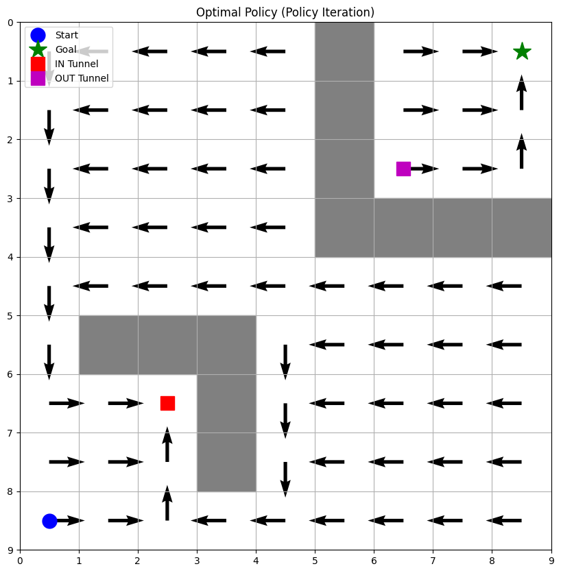

# Question 1
_Important Outcomes_ : Value Iteration and Policy Iteration yielded the same optimal values for each state.

The optimal policy suggests that the student prefers to go to the canteen when in the hostel or academic building, reflecting the reward structure and transition probabilities.

Policy Iteration was able to directly determine the optimal actions for each state, while Value Iteration focuses on refining the value function until convergence.

# Question 2

