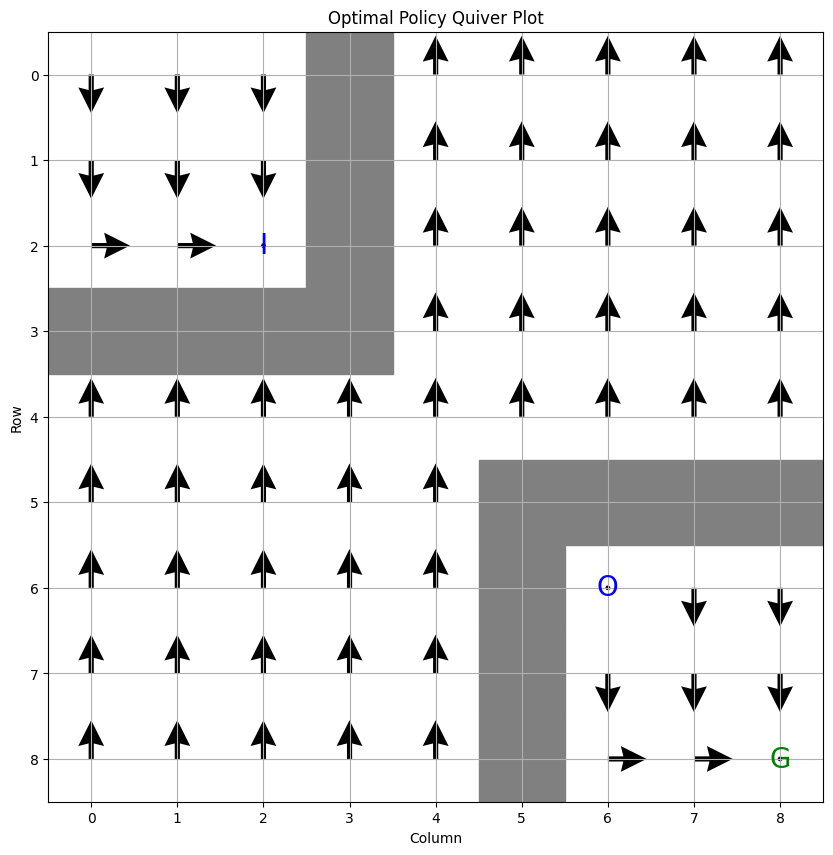
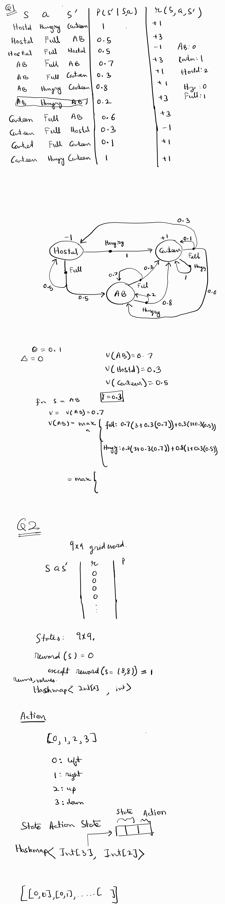

# Structure 
All code is inside src folder

Q1Marl.java contains code for question 1

Q2Marl.java contains code for question 2

# Execution
- Go to [Online Java Compiler](https://www.onlinegdb.com/online_java_compiler)
- Past the code from respective file
- hit run

### Note 
The code has been modified to allow easy execution in online environment. To run it offline using local compiler, rename the file you want to run to Main.java.


## Q1 
Actions: {Hungry, Full}

States: {Academic Block, Centeen, Hostel}
### Optimal policy

Optimal action for Academic Block : Full

Optimal action for Canteen : Full

Optimal action for Hostel : Full


### Values

Value for Academic Block : 20.940507101925746

Value for Canteen : 19.807391609393477

Value for Hostel : 18.951317016750767
## Q2 

### q2 quiver plot
```
Final state values:
 0.818  0.909  1.010  0.909  0.000  0.000  0.000  0.000  0.000 
 0.909  1.010  1.122  1.010  0.000  0.000  0.000  0.000  0.000 
 1.010  1.122  1.247  1.122  0.000  0.000  0.000  0.000  0.000 
 0.909  1.010  1.122  0.000  0.000  0.000  0.000  0.000  0.000 
 0.000  0.000  0.000  0.000  0.000  0.000  0.000  0.000  0.000 
 0.000  0.000  0.000  0.000  0.000  0.000  1.247  1.385  1.539 
 0.000  0.000  0.000  0.000  0.000  1.247  1.385  1.539  1.710 
 0.000  0.000  0.000  0.000  0.000  1.385  1.539  1.710  1.900 
 0.000  0.000  0.000  0.000  0.000  1.539  1.710  1.900  1.000 

Optimal Policy:
  D    D    D    #    U    U    U    U    U  
  D    D    D    #    U    U    U    U    U  
  R    R    I    #    U    U    U    U    U  
  #    #    #    #    U    U    U    U    U  
  U    U    U    U    U    U    U    U    U  
  U    U    U    U    U    #    #    #    #  
  U    U    U    U    U    #    O    D    D  
  U    U    U    U    U    #    D    D    D  
  U    U    U    U    U    #    R    R    G  
```


## Written work
