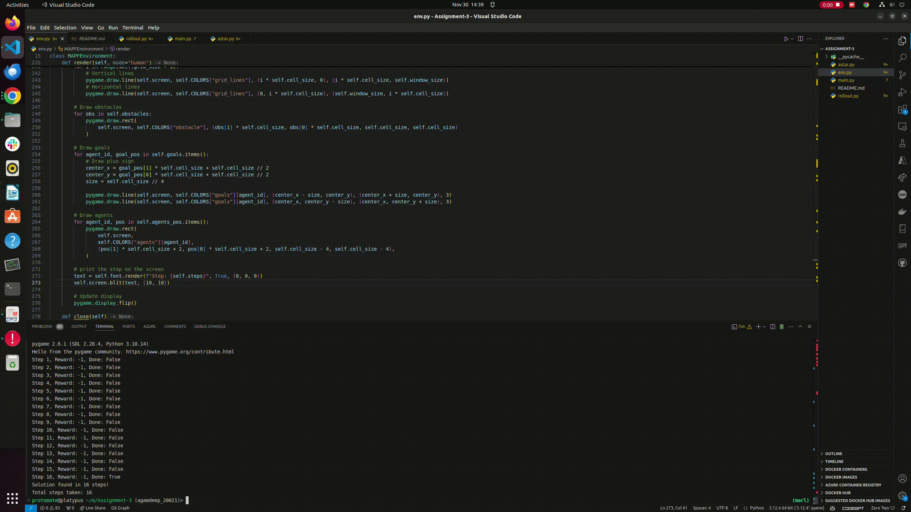

# assignment-3
# Multi-Agent Path Finding (MAPF) with Rollout Planning

This project implements a solution to the Multi-Agent Path Finding (MAPF) problem using rollout-based planning with A* pathfinding. The implementation successfully solves a 10x10 grid environment with 4 agents and obstacles in approximately 15 steps.



## Problem Description

The MAPF problem involves:
- Multiple agents on a grid, each with unique start and goal positions
- Obstacles that agents must navigate around
- Constraints where only one agent can occupy a cell at a time
- Goal to minimize the maximum time taken by any agent to reach its destination


### Environment Setup
- 10x10 grid world
- 4 agents with distinct colored start positions and goals
- Fixed obstacles creating corridors and U-shaped barriers
- Agents can move Up, Down, Left, Right, or Stay in place

## Results

The implementation achieves:
- Solution in approximately 15 steps
- Successful collision avoidance
- Efficient path planning around obstacles
- Real-time visualization of agent movements


## Solution Approach

The solution combines several key components:

1. **Rollout Planning**: 
   - Simulates multiple possible future trajectories
   - Uses depth-limited lookahead
   - Selects actions that lead to best outcomes
   - Parameters:
     - `num_rollouts=50`: Number of simulated trajectories
     - `depth=150`: How far to look ahead in each rollout

2. **A* Pathfinding**:
   - Finds optimal paths around obstacles
   - Handles U-shaped traps effectively
   - Considers other agents as dynamic obstacles
   - Uses true path distance instead of Manhattan distance

3. **Collision Avoidance**:
   - Prevents destination conflicts
   - Avoids path crossing conflicts
   - Maintains safe distances between agents

## Implementation Details

### Key Components:

1. `mapf_env.py`: Core environment implementation
   - Grid world mechanics
   - State management
   - Pygame visualization

2. `astar_pathfinding.py`: A* implementation
   - Optimal path finding
   - Dynamic obstacle handling
   - Action conversion

3. `rollout.py`: Rollout planner
   - Monte Carlo simulations
   - Action selection
   - Future state evaluation

## Usage

### Requirements
```bash
pip install numpy pygame
```

### Running the Solution
```python
from mapf_env import MAPFEnvironment
from rollout import RolloutPlanner

# Create environment and planner
env = MAPFEnvironment()
planner = RolloutPlanner(env, num_rollouts=50, depth=150)

# Reset environment
env.reset()

# Main loop
while not done:
    actions = planner.do_rollout()
    next_states, reward, done, info = env.step(actions)
    env.render()
```


