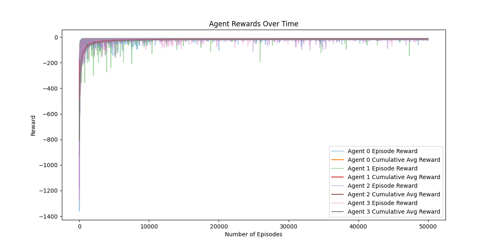
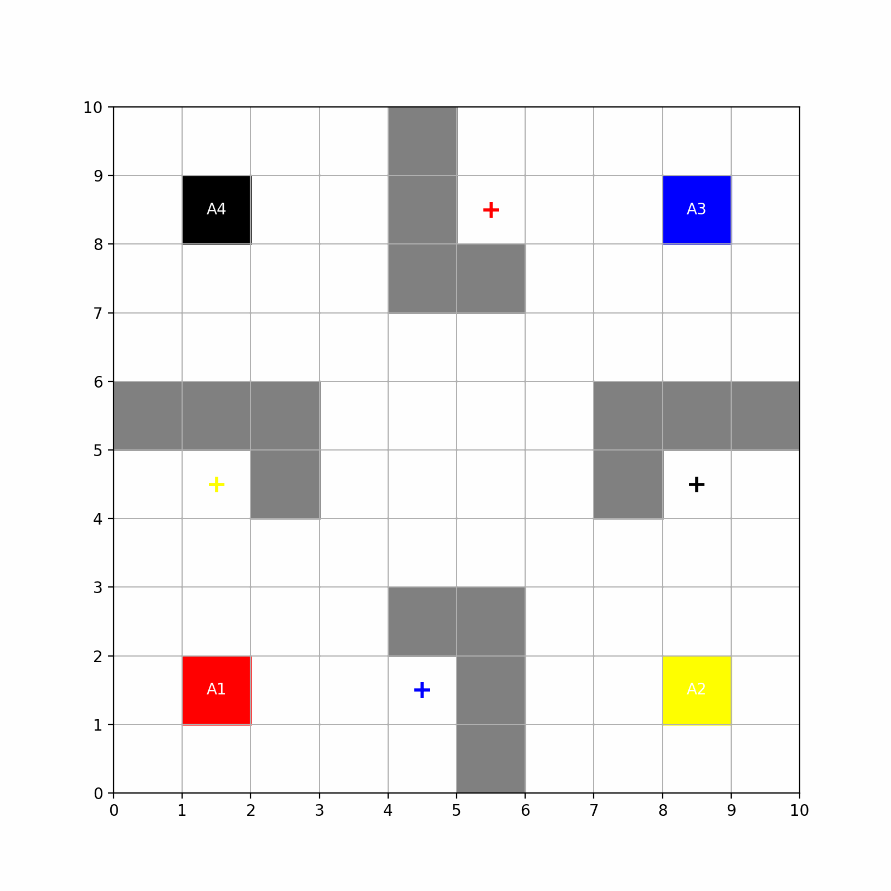
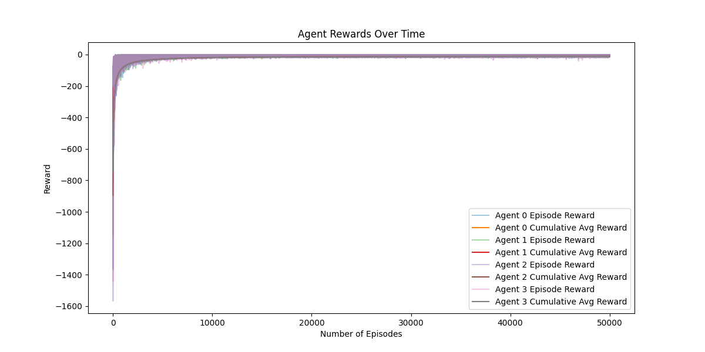
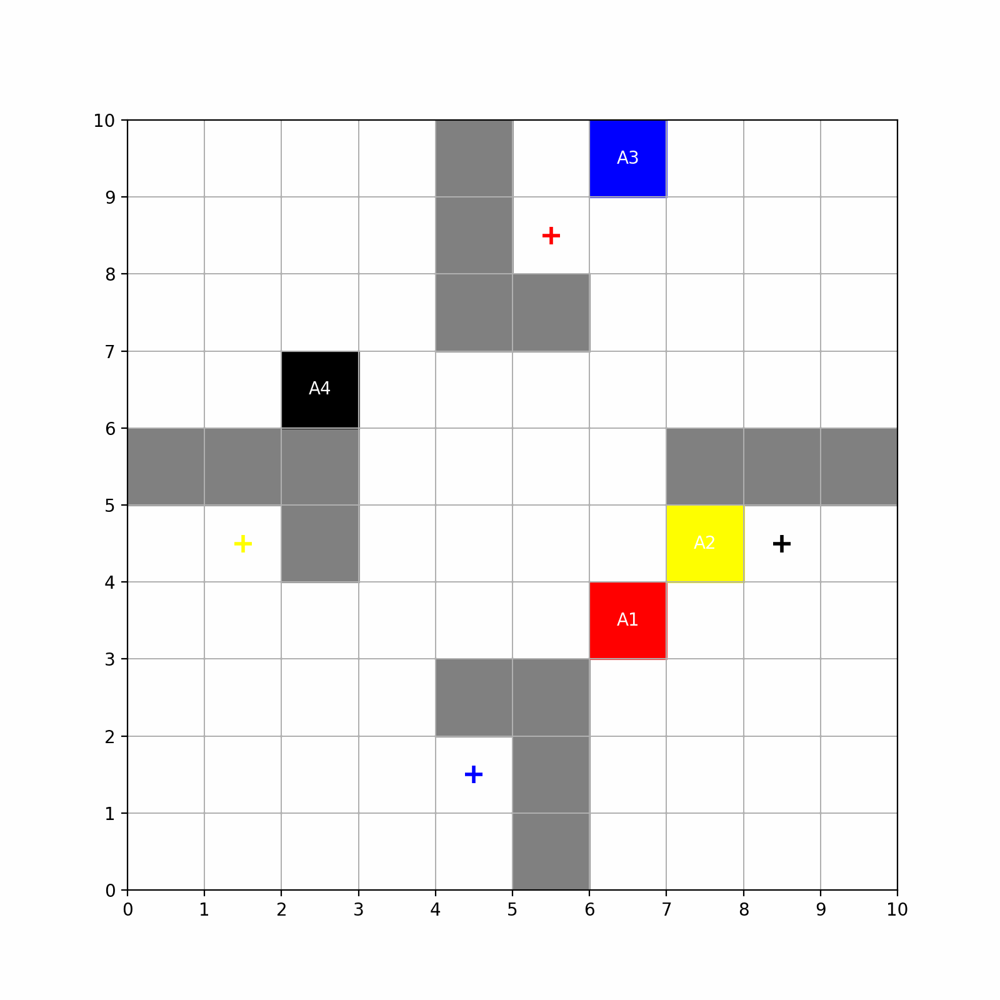

# Multi-Agent Reinforcement Learning - Assignment-3
## Name: Aditya Mishra
## Roll Number: 21013

## Question-1
>Your aim is to develop a multi-agent reinforcement learning strategy that minimizes the overall time required for all agents to reach their destinations. Specifically, you should seek to reduce the maximum time taken by any single agent to reach its goal. You may employ multi-agent rollouts as part of your approach. Once complete, report the minimum time achieved by your solution.


---
### Minimum time (or number of steps) required for all the agents to reach their goal: 13 steps 
---   

### The Episodic Reward vs Cumulative Reward curve for question-1 is as follows:


--- 

### Policy Learned when the starting point is fixed is depicted below:


--- 

## Question-2
>As a bonus challenge, solve the MAPF problem where each agent’s starting position is randomized for every epoch or episode while all other parameters and conditions remain the same.

---

### The Episodic Reward vs Cumulative Reward curve for question-2 is as follows:


--- 

### Policy Learned when the starting point is randomly initialised (intersection not allowed) is depicted below:


--- 

## How to run the code?
```bash
python3 -m venv .venv
source .venv/bin/activate
pip3 install matplotlib numpy
python3 answer.py

#To run question-1
Enter mode (1 for fixed, 2 for random): 1

#To run question-2
Enter mode (1 for fixed, 2 for random): 2
```
---


