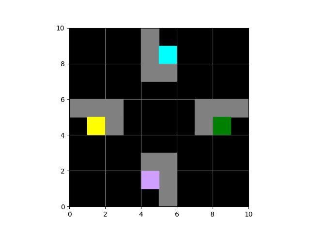
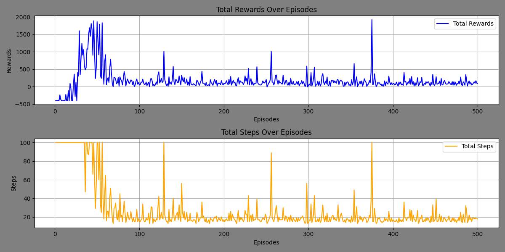

# Multi-Agent Reinforcement Learning (MARL) - Assignment 3

This repository contains the implementation of Assignment 3 for the course ECS/DSE-427/627: Multi-Agent Reinforcement Learning. The task involves solving the Multi-Agent Path Finding (MAPF) problem in a grid world environment using reinforcement learning strategies.

## Directory Structure

```
.
├── trained_Agents.png              # Visualization of agents at their final positions
├── env2.py                        # Alternate environment setup
├── env.py                         # Environment script for the grid world
├── evaluate.py                    # Script for evaluating the trained agents
├── __init__.py                    # Initialization file for the module
├── MARL - Assignment-3.pdf        # Assignment description document
├── __pycache__                    # Cached Python files
├── README.md                      # This README file
├── requirements.txt               # Dependencies for the project
├── results.png                    # Visualization of rewards and steps over episodes
├── train.py                       # Script for training the agents
└── visualize.py                   # Visualization of agent movements
```

## Assignment Details

### Problem Statement

The Multi-Agent Path Finding (MAPF) problem involves:
- Navigating multiple agents within a grid world environment.
- Each agent starts at a unique position and must reach a fixed goal location while:
  - Avoiding obstacles.
  - Preventing collisions with other agents.
- Constraints include:
  - Only one agent can occupy a cell at a time.
  - Agents must avoid colliding with each other.

The goal is to minimize the overall time required for all agents to reach their destinations.

#### **Bonus Challenge**

Solve the MAPF problem with randomized starting positions for agents in each episode. It is solved using the `env2.py` file.

### Environment Setup

1. Grid world environment includes:
   - Multiple agents with distinct starting and goal positions.
   - Obstacles that cannot be passed.
2. Available actions:
   - Move up, down, left, or right.
   - Stay in place.
3. Reward structure:
   - Penalty of -1 for each step until all agents reach their goals.

### Solution Objective

Minimize the maximum time taken by any agent to reach its goal.

## Installation and Setup

1. Clone the repository:
   ```bash
   git clone <repository-url>
   cd Assignment-3
   ```

2. Create and activate a virtual environment using Conda:
   ```bash
   conda create -n marl python=3.12.7
   conda activate marl
   ```

3. Install dependencies:
   ```bash
   pip install -r requirements.txt
   ```

## Usage

### Training the Agents

Run the following command to train the agents:
```bash
python train.py
```

Training results will be saved, including training logs of each episode (rewards and steps taken).



### Visualizing Rewards and Steps

Rewards and steps during training can be visualized using:
- `visualize.py`: Displays the agents' cumulative rewards and steps taken over episodes. You will have to load the `training_logs.pkl` file.



### Evaluating Trained Agents

To evaluate the trained agents:
1. Load the `q_tables.pkl` file.
2. Run the `evaluate_agents()` function in `visualize.py`:
   ```bash
   python evaluate.py
   ```

## Results Analysis

### Training Results

1. **Rewards and Steps Over Episodes**
   - Agents were trained over 500 episodes.
   - **Rewards**: Initial fluctuations as agents explore actions. Rewards stabilize over time, indicating convergence to effective strategies.
   - **Steps**: Maximum steps initially decrease over episodes, reflecting more efficient paths.

2. **Agent Performance and Completion Times**
   - All agents reached their goals.
   - **Final Rewards by Agent**:
     - `agent_0`: -2
     - `agent_1`: -2
     - `agent_2`: -2
     - `agent_3`: 31
   - **Completion Times (seconds)**:
     - `agent_3`: 5.04 (Rank 1)
     - `agent_0`: 6.61 (Rank 2)
     - `agent_1`: 6.61 (Rank 3)
     - `agent_2`: 6.61 (Rank 4)

   - **Ranking**: `agent_3` consistently outperformed other agents.

3. **Q-Table Analysis**
   - Policies converge, with agents preferring actions minimizing distance and avoiding penalties.

## Visualizations

### Final Positions


### Rewards and Steps


## Contribution

Feel free to fork the repository and submit pull requests for improvements or bug fixes.

## License

This project is licensed under the MIT License. See the LICENSE file for details.
