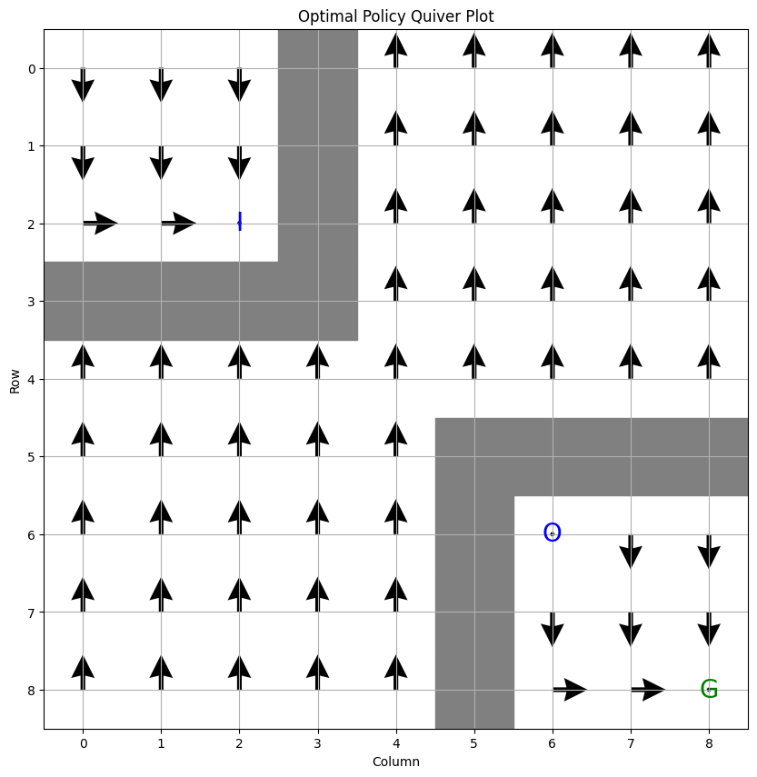
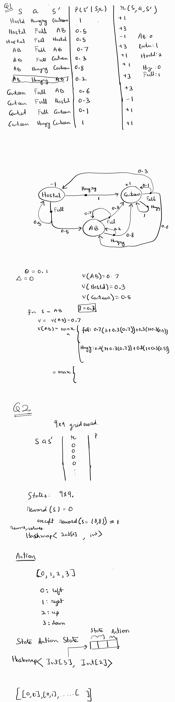

# Structure 
All code is inside src folder

Q1Marl.java contains code for question 1

Q2Marl.java contains code for question 2

# Execution
- Go to [Online Java Compiler](https://www.onlinegdb.com/online_java_compiler)
- Past the code from respective file
- hit run

### Note 
The code has been modified to allow easy execution in online environment. To run it offline using local compiler, rename the file you want to run to Main.java.

## q2 quiver plot

## Q1 + Q2 report and written work
