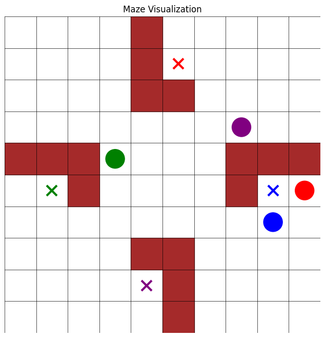

# Multi-Agent Pathfinding

This project solves the Multi-Agent Pathfinding (MAPF) problem using Q-Learning and multi-agent rollouts. The objective is to minimize the maximum time any agent takes to reach its destination.Additionally the maze environment is randomized for each episode in the bonus problem, with agents starting from new positions while all other parameters (like destinations and obstacles) remain the same.

---

## Key Features

- **Multi-Agent Rollouts**: Agents explore paths and refine their strategies collectively across multiple episodes.
- **Agent Communication**: Agents communicate indirectly by considering other agents' positions as part of their decision-making process, avoiding collisions.
- **Dynamic Environment (FOR BONUS)**: Starting positions for agents are randomized in every episode to ensure robust learning.
- **Optimal Path Visualization**: The learned optimal paths for each agent are visualized with arrows showing movement direction.

---

## Rollouts and Communication

### **Multi-Agent Rollouts**
Rollouts are simulations where agents collectively navigate the maze over multiple episodes. These episodes are used to:
1. Explore the environment (with some random actions to promote exploration).
2. Update the Q-tables for each agent based on rewards and penalties.
3. Ensure agents learn to minimize the maximum time across all agents.

### **Agent Communication**
Agents communicate implicitly:
1. **Position Awareness**: Each agent avoids moving into positions occupied by others.
2. **Shared Environment**: Agents respect the constraints of the shared maze, including walls and occupied cells.
3. **Collaborative Goal**: Although agents operate independently, their learning is driven by the shared reward structure, incentivizing them to minimize collective completion time.

---

## Reward Structure

- **Step Penalty**: Each step incurs a penalty of -1.
- **Goal Reward**: Reaching the destination rewards the agent with +10.
- **Collision Avoidance**: Agents cannot move into cells occupied by other agents, indirectly encouraging coordinated navigation.

---

## Results

### Example Maze
Below is a sample randomized maze generated during training:

### Optimal Path Visualization
After training, the optimal paths for each agent are visualized below. Each path is represented by arrows indicating the direction of movement, with destinations marked as colored crosses:

