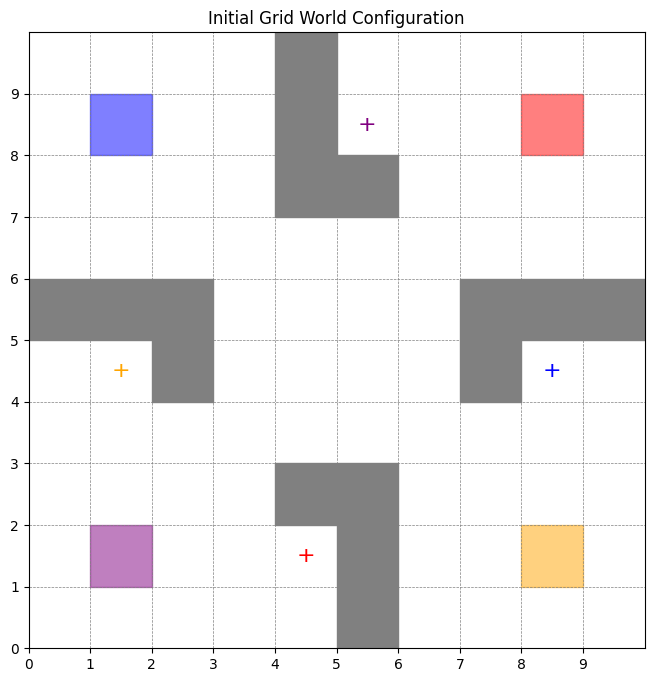
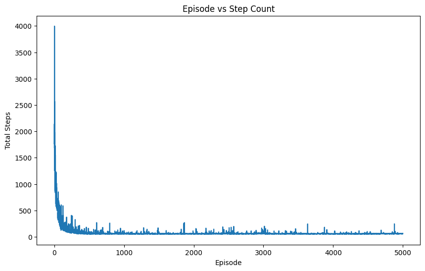
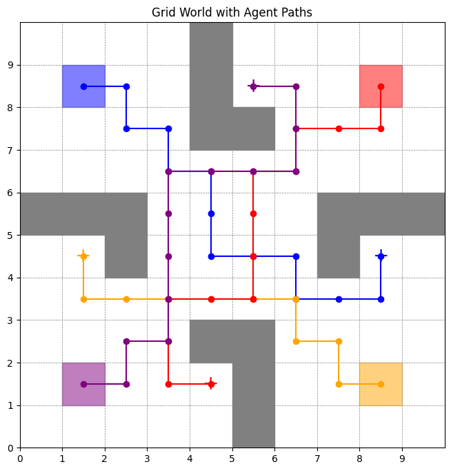
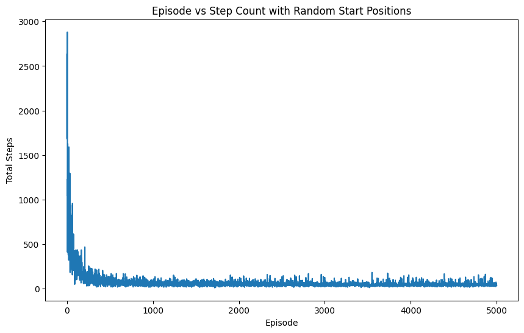
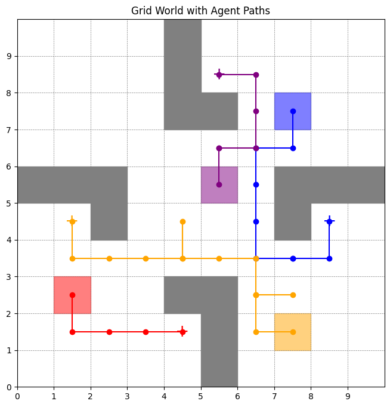

# Assignment 3
### By MANISH GAYEN 21161

## Problem Statement:
Given a grid environment with obstacles, 4 agents with a fixed initial position and 4 goals respectively, enable the agents to reach their respective goals in minimum steps possible.

### My approach:
Each agent uses Q-learning with an epsilon-greedy policy to select actions: with probability ε, a random action is chosen (exploration), and with probability 1-ε, the agent selects the best action based on its learned Q-values (exploitation). The reward structure penalizes agents for each step taken (except when reaching the goal), and agents must avoid collisions with each other and obstacles. The agents learn to minimize the total number of steps to reach their unique goals. After training, the learned policies are used to evaluate the agents' paths and step counts.

### Initial grid (to be solved):

### Convergence plot:

### Solution obtained:

Total steps taken by all agents combined: 49

Plot showing the paths is as follows:

## Bonus Problem Statement:
Same grid environment, but this time the initial positions of the agents gets randomized after each episode while the other parameters are kept same.

### My approach:
Same approach is used as earlier, with the necessary modifications for the randomization.

### Convergence plot:

### Solution obtained:

Best step count obtained at some random initial position configuration: 8

Step count for the last episode's initial position configuration: 33

Plot showing the paths is as follows:

