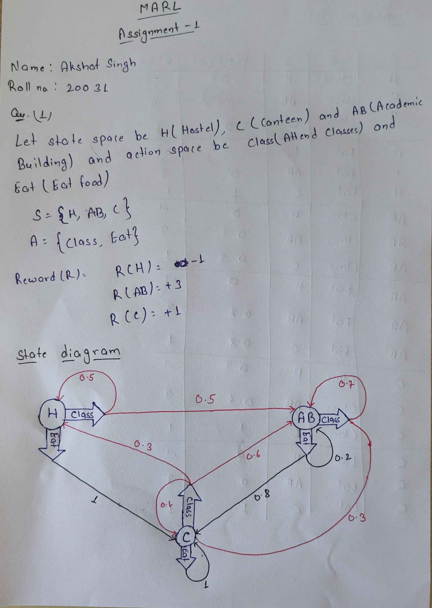
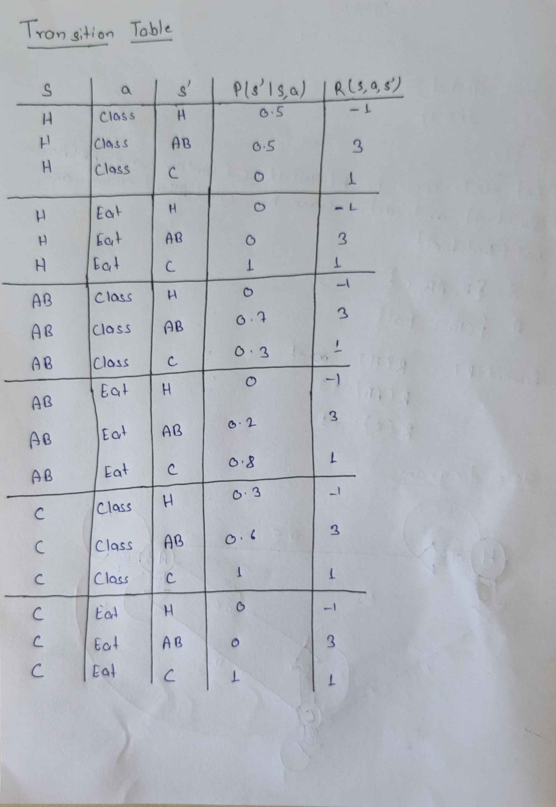

# Parameters

* gamma = 0.999
* epsilon = 1e-6

Here gamma is the discount factor in MDP, the value is not converging for a very long time for gamma = 1 so the above value is chosen, and epsilon is the tolerance for convergence

# Value Iterations:
value(Hostel) = 2038.8797

value(Academic_Building) = 2044.9636

value(Canteen) = 2041.7769

**Optimal Policy:**

π(Hostel) = Class

π(Academic_Building) = Class

π(Canteen) = Class

# Policy Iterations:
value(Hostel) = 2038.8797

value(Academic_Building) = 2044.9636

value(Canteen) = 2041.7769

**Optimal Policy:**
π(Hostel) = Class

π(Academic_Building) = Class

π(Canteen) = Class

# Discussions

## State Diagram

## Combination Table

As can be seen from the results both the policy and value iteration values and policies converge to the same values.
