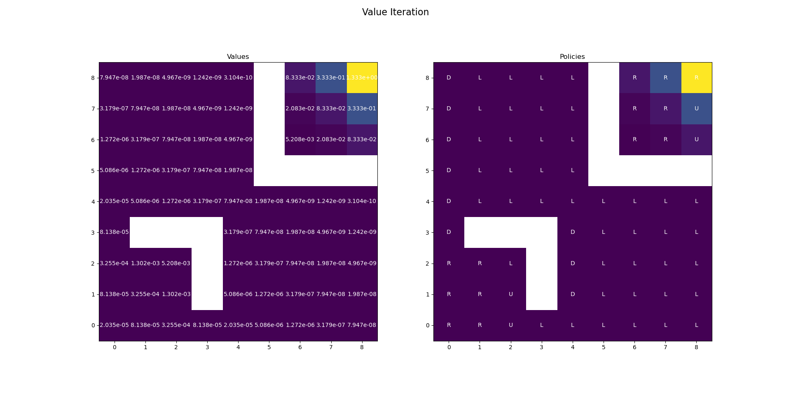

# Running the code

Here in ```Program.cs``` in ```line 156``` change the Python DLL/so file to your environment's DLL/so file for the python code to run,```Python3.10``` or higher 

# Assumptions

* It is assumed that after each step the robot can move only to one of its neighbour tile in the Left, Right, Up and Down directions, each with probabilities 0.25. 
* It is also assumed that if an action is taken from a tile to another tile such that the next tile is either out of bounds or an obstacle, the robot will remain at the same tile
* If the robot is at the Portal In tile, it will automatically be teleported to the Portal Out tile without taking any steps

# Parameters

* gamma = 1
* epsilon = 1e-15

Here gamma is the discount factor in MDP, epsilon is the tolerance for convergence, it is given a value smaller than the order of 1e-11 as that was the smallest value of the MDP

# Value Iterations:

The following image provides both the value for each state as well as the policy taken at each state(quiver plot).



Here the Portal In is given a default policy "Left" but it has no meaning as this will lead automatically to the state Portal Out.

For Goal Tile, either Up or Right policy is taken as that will lead to the robot being at the same tile but that is also meaningless as there is no point of talking about what happens after the goal is reached.

# Policy Iteration

The following image provides both the value for each state as well as the policy taken at each state(quiver plot). All the assumptions and comments from Value Iteration apply for Policy iteration as well


