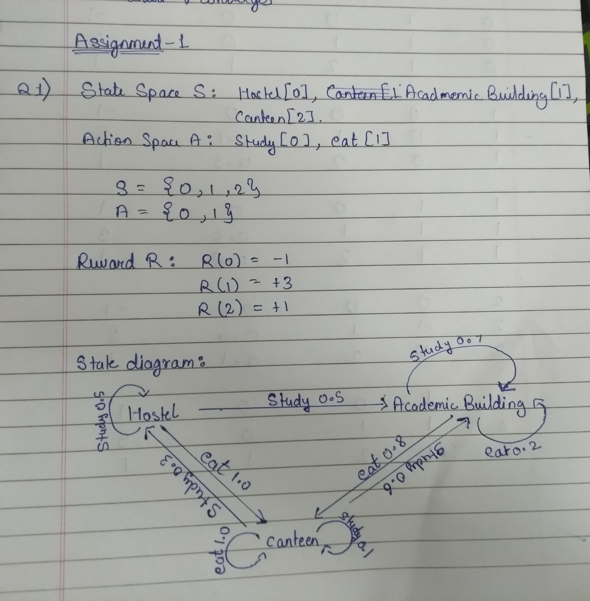
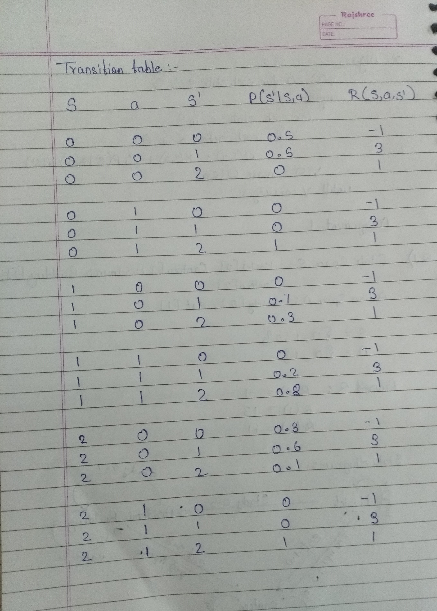
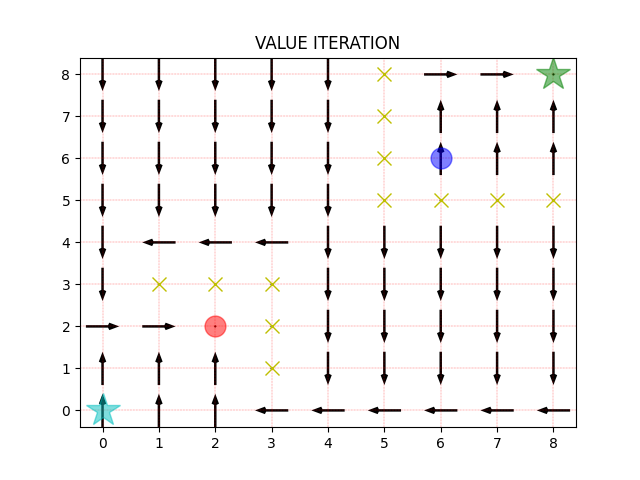

# Question_1
Gamma = 0.9
## Policy Iteration Values
Value:-
Hostel: 16.05619186 
Academic Building: 21.84646991 
Canteen: 18.82666486
Policy:- 
Hostel: Study 
Academic Building: Study 
Canteen: Study

## MDP Diagram

## Transition Table

# Question_2

