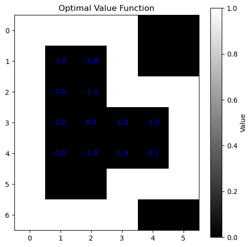
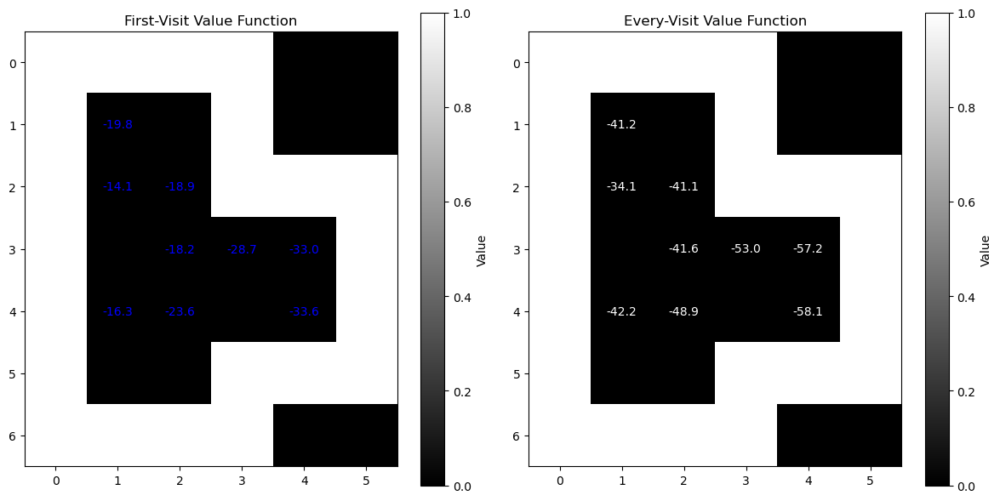

# Performance Comparison of Dynamic Programming and Monte Carlo Methods

## Introduction

This markdown file provides a comparative analysis of two reinforcement learning methods: Dynamic Programming (DP) and Monte Carlo (MC). Both methods were implemented to solve a grid-based warehouse problem where an agent pushes boxes to designated storage locations.

## Methodology

### Dynamic Programming (DP)

- **Implementation**: The DP algorithm used value iteration to compute the optimal value function.
- **Convergence**: The algorithm iteratively updates the value function until the change in values is below a specified threshold.
- **Efficiency**: DP systematically evaluates all possible actions and state transitions, leading to a precise and optimal solution.
- **Values Obtained**: After a specified number of iterations, the value function converged to values around \(-1.0, -1.9, 0.0, -1.0\).

### Visual Output of DP method 

### Monte Carlo (MC)

- **Implementation**: The MC method utilized both First-Visit and Every-Visit strategies to estimate the value function through sample episodes.
- **Exploration**: The agent generated episodes from random starting positions, and the values were updated based on the returns from these episodes.
- **Variance**: The MC approach exhibited higher variance in its estimates, particularly in the early episodes.
- **Values Obtained**: After 5,000 episodes, the value function stabilized around values like \(-40.1, -39.2, -42.4\).

### Visual Output of MC method 

## Comparison

### 1. **Convergence Speed**
- **DP**: Converges quickly due to its systematic approach. The optimal value function was reached in fewer iterations.
- **MC**: Requires many episodes to stabilize, leading to slower convergence. The estimates were often unstable in early iterations.

### 2. **Value Accuracy**
- **DP**: Provided values that closely aligned with expected optimal values, indicating high accuracy in the value function.
- **MC**: The values were significantly off from the optimal, suggesting that the exploration strategy or number of episodes was insufficient for accurate estimates.

### 3. **Stability**
- **DP**: Values showed minimal fluctuation, demonstrating stability in learning.
- **MC**: Higher variance in values, particularly in the early episodes, which could lead to less reliable estimates.

### 4. **Sample Efficiency**
- **DP**: Efficiently updates values using the entire state space in a model-based manner.
- **MC**: Less sample efficient, as it requires many episodes to gather sufficient data for accurate value estimation.

## Conclusion

Based on the implementation and results, **Dynamic Programming** outperformed **Monte Carlo** in this grid-based warehouse problem. DP provided more accurate, stable, and efficient learning of the optimal value function compared to the higher variance and slower convergence observed in the Monte Carlo method. 
