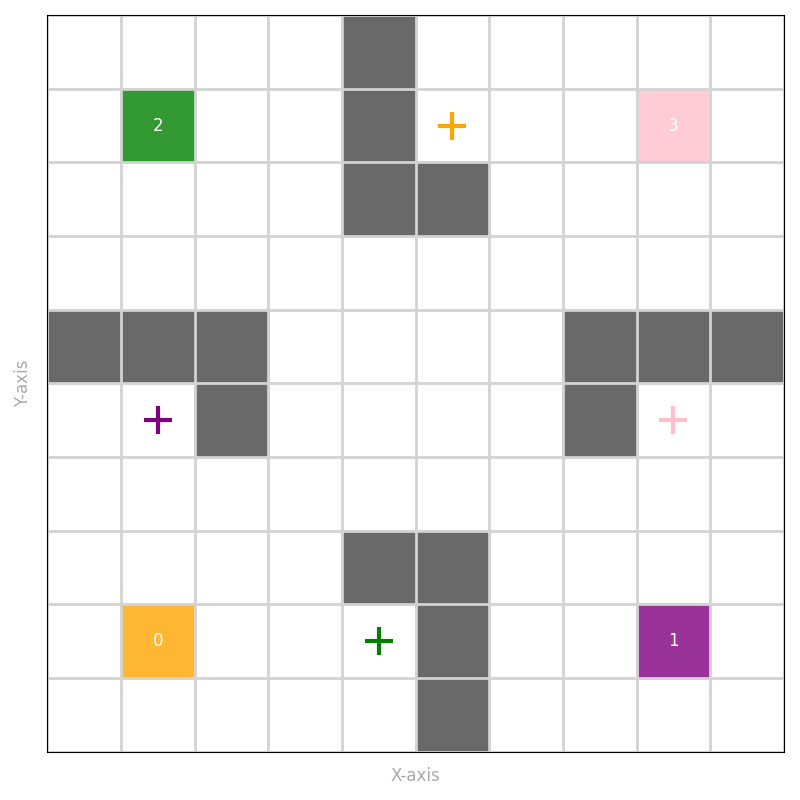
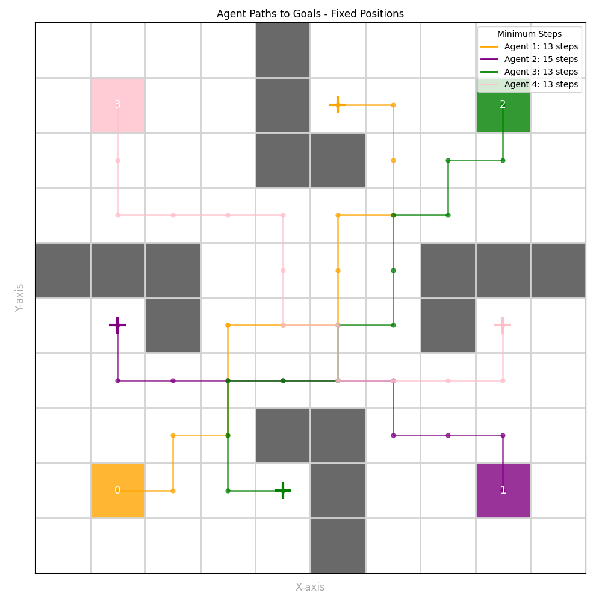
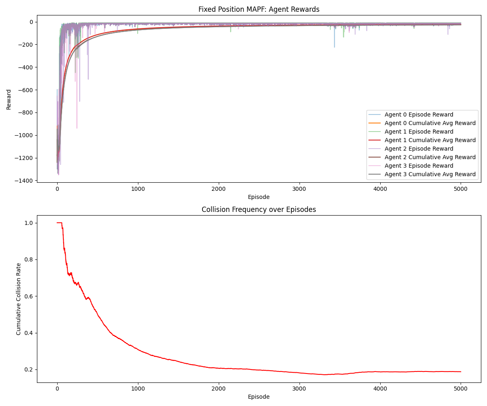

## README for Fixed Environment
## MAPF Fixed Environment

This repository contains code for solving Multi-Agent Path Finding (MAPF) using a fixed environment setup. The code provides a grid-based environment with agents that move towards their goal positions, avoiding obstacles.
File Structure

## The project is organized as follows:

Fixed/
│
├── Fixed_env.py        # Contains the environment setup with fixed agent and goal positions
├── trainer.py          # Code for training agents to navigate the MAPF environment
├── Viz_fix.py          # Visualization code to display the MAPF environment and agents' movements
├── mapf_env_fixed.png  # Plot showing the environment with walls, agents, and goals
├── agent_traj.png      # Plot showing agent paths
├── rewards.png         # Plot showing the rewards per step

Files Description

    Fixed_env.py:
        This file contains the definition of the fixed MAPF environment, including agent positions, goal positions, and walls.
        The agent positions and goals are predefined, and their movement is controlled through action commands.
        The execute_action function updates agent positions and calculates rewards.

    Trainer_fixed.py:
        This file includes the training loop for agents in the MAPF environment. It uses reinforcement learning techniques to train agents to reach their goals while avoiding obstacles and other agents.
        It interacts with Fixed_env.py to execute agent actions and gather feedback.

    Visual_fix.py:
        This file contains the visualization logic. It uses matplotlib to display the environment with agents, goals, and walls. The plot is saved in the plots/ directory.

## Libraries Required

To run the code, the following libraries are required:

pip install numpy matplotlib

## How to Run

    Step 1: Clone the repository or download the files.
    Step 2: Install required dependencies:

pip install -r requirements.txt

Step 3: run the Visual_fix.py script to visualize the environment and training agents:

    python Visual_fix.py

    This will generate the plots in the plots/ directory.

## Plots

1. **MAPF Environment - Fixed Setup**
   

2. **Agent Trajectories**
   

3. **Rewards per Step**
   

## outputs

min steps : Agent1, Agent2, Agent3, Agent4 : 13,15,13,13 for 5000 episodes
