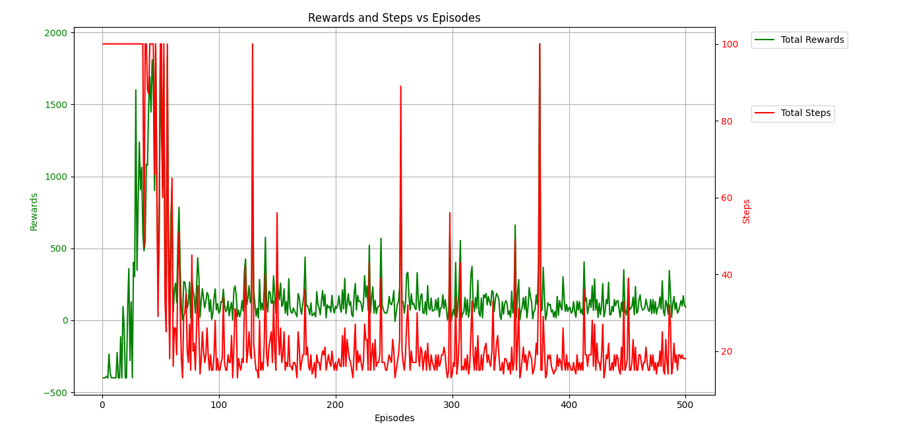

## Assignment Goal

Develop a multi-agent reinforcement learning strategy that minimizes the overall
time required for all agents to reach their destinations. Specifically, that minimize
the maximum time taken by any single agent to reach its goal. Employed multi-agent
rollouts as part of this approach. After completation, the minimum time achieved by this
solution is reported.

## Environment Setup

1. Grid world environment includes:
   - Multiple agents with distinct starting and goal positions.
   - Obstacles that cannot be passed.
2. Available actions:
   - Move up, down, left, or right.
   - Stay in place.
3. Reward structure:
   - Penalty of -1 for each step until all agents reach their goals.

## For Train the Agents

Run: train.py

Training results will be saved with training logs that include training rewards of each episode, steps to taken to reach the final position.

## For Test the Agents Movement

Run: test.py

To test the trained agents behaviour using Q-tables: Load `Q_tables.pickle` file.

https://github.com/user-attachments/assets/6c503b9a-8ff7-4af9-b4ea-a56c45b370f4

## Visualizing Rewards and Steps

Rewards and steps during training can be visualized by Running: visualize.py

## Results Analysis

1. **Rewards and Steps Over Episodes**
   - Agents were trained over 500 episodes.
   - **Rewards**: Initial fluctuations as agents explore actions. Rewards stabilize over time, indicating convergence to effective strategies.
   - **Steps**: Maximum steps initially decrease over episodes, reflecting more efficient paths.

2. **Completion Times**

     - `agent_3`: 11.71 
     - `agent_0`, `agent_1`, `agent_2`: 15.11 

3. **Q-Table Analysis**
   - Policies converge, with agents preferring actions minimizing distance and avoiding penalties.

## Visualizations

