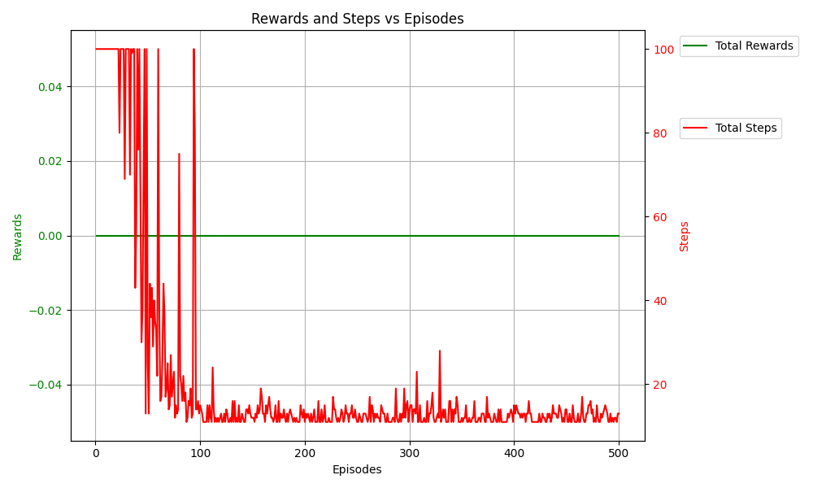

## **Bonus Challenge**

As a bonus challenge, solve the MAPF problem where each agent’s starting position is
randomized for every epoch or episode while all other parameters and conditions remain the
same.

## Environment Setup

1. Grid world environment includes:
   - Multiple agents with random starting and goal positions.
   - Obstacles that cannot be passed.
2. Available actions:
   - Move up, down, left, or right.
   - Stay in place.
3. Reward structure:
   - Penalty of -1 for each step until all agents reach their goals.

## For Train the Agents

Run: train.py

Training results will be saved with training logs that include training rewards of each episode, steps to taken to reach the final position.

## For Test the Agents Movement

Run: test.py

To test the trained agents behaviour using Q-tables: Load `Q_tables.pickle` file.

## Visualizing Rewards and Steps

Rewards and steps during training can be visualized by Running: visualize.py

## Results Analysis

1. **Rewards and Steps Over Episodes**
   - Agents were trained over 500 episodes.
   - **Rewards**: Constant over the each episodes.
   - **Steps**: Maximum steps initially decrease over episodes, reflecting more efficient paths.

2. **Q-Table Analysis**
   - Policies converge, with agents preferring actions minimizing distance and avoiding penalties.

## Visualizations

