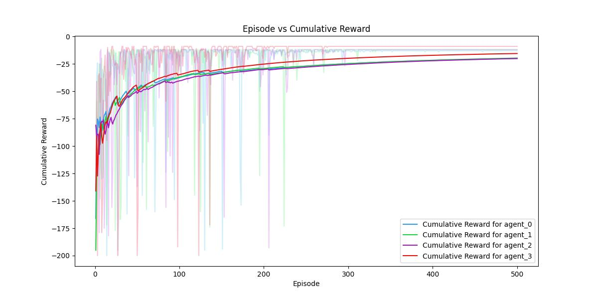
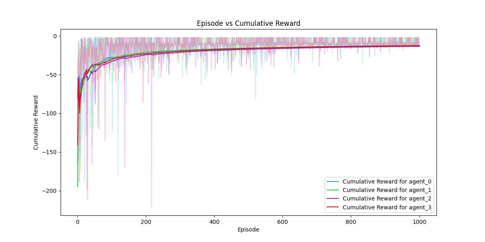

# Assignment 3 - MAPF Problem  

### **Q.1**  

>Your aim is to develop a multi-agent reinforcement learning strategy that minimizes the overall time required for all agents to reach their destinations. Specifically, you should seek to reduce the maximum time taken by any single agent to reach its goal. You may employ multi-agent rollouts as part of your approach. Once complete, report the minimum time achieved by your solution.  

---
- **Minimum time required for all the agents to reach their goal:** **13 steps**  
  *Note: Here, time is represented as the number of steps needed to reach the goal and is equal to the absolute value of the episodic reward of the agent.*  

---

### **The Policy Learned by the Agents When the Starting Point is Fixed:**  

 

  

---

### **Cumulative Reward of Each Agent Over an Episode:**  
  

---

### **Q.2 BONUS**  
 
>As a bonus challenge, solve the MAPF problem where each agent’s starting position is randomized for every epoch or episode while all other parameters and conditions remain the same.  

---

### **The Policy Learned by the Agents When the Starting Point is Random:**  

 

  

---

### **Cumulative Reward of Each Agent Over an Episode:**  
  

---

### **Note:**  
*All images used in the simulation are included with the consent of the respective individual.*  
