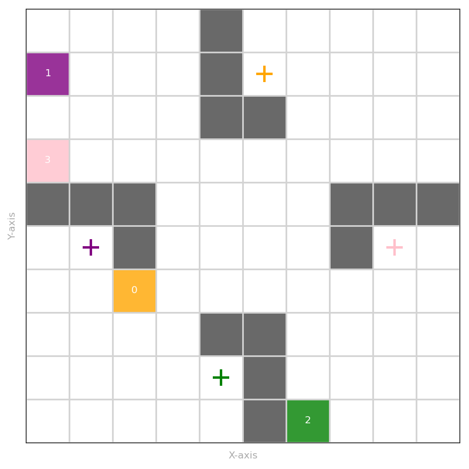
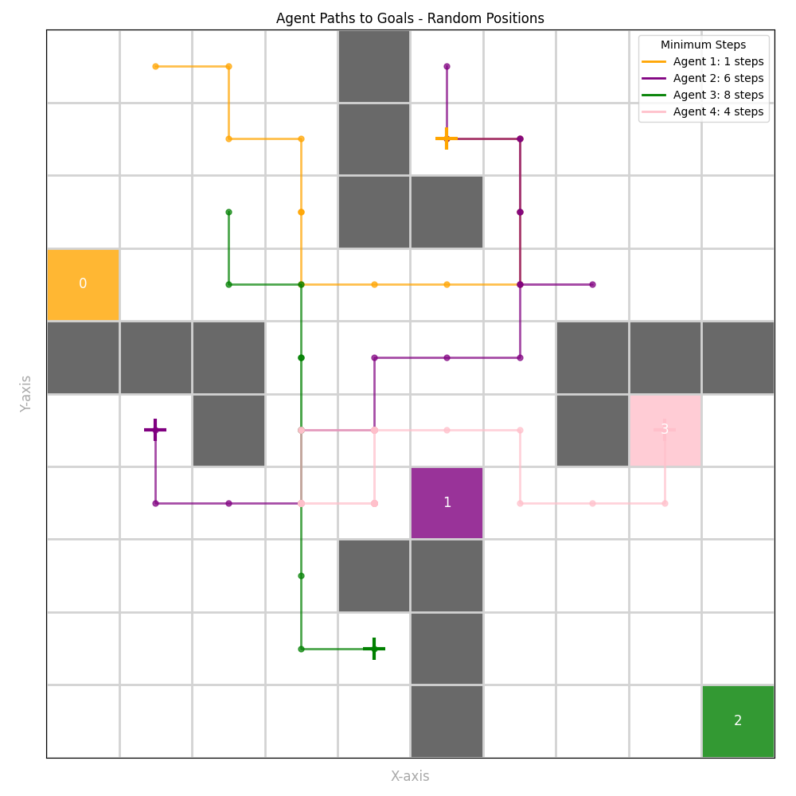
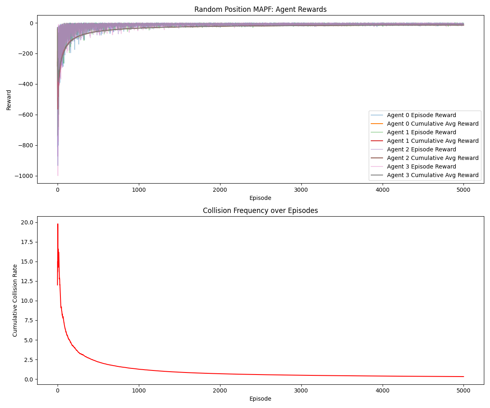

## README for Random Environment
## MAPF Random Environment

This repository contains code for solving Multi-Agent Path Finding (MAPF) using a randomized environment setup. The code provides a grid-based environment with agents that move towards their goal positions, avoiding obstacles, and each agent's start and goal positions are randomly assigned.
File Structure

The project is organized as follows:

Random/
│
├── Random_env.py        # Contains the environment setup with random agent and goal positions
├── trainer.py           # Code for training agents to navigate the MAPF environment
├── Viz_random.py        # Visualization code to display the MAPF environment and agents' movements
├── mapf_env_random.png  # Plot showing the environment with walls, agents, and goals
├── agent_traj.png      # Plot showing agent paths
└── rewards.png         # Plot showing the rewards per step

## Files Description

    Random_env.py:
        This file contains the definition of the randomized MAPF environment, including randomly assigned agent positions with fixed goal positions.
        The agent positions are randomly generated on each run. The movement and reward calculations are similar to the fixed environment.
        The execute_action function updates agent positions and calculates rewards.

    Trainer_ran.py:
        This file includes the training loop for agents in the MAPF environment. It uses Q learning Agenttrain agents to reach their goals while avoiding obstacles(walls) and other agents.
        It interacts with Random_env.py to execute agent actions and gather feedback.

    Visual_ran.py:
        This file contains the visualization logic. It uses matplotlib to display the environment with agents, goals, and walls. The plot is saved in same folder.

## Libraries Required

To run the code, the following libraries are required:

pip install numpy matplotlib

## How to Run

    Step 1: Clone the repository or download the files.
    Step 2: Install required dependencies:

pip install -r requirements.txt

Step 3: run the Visual_ran.py script to visualize the environment and training agents:

    python Visual_ran.py

    This will generate the plots in the plots/ directory.

## Plots

1. **MAPF Environment - Fixed Setup**
   

2. **Agent Trajectories**
   

3. **Rewards per Step**
   

## Issues and Conclusion

While the randomized environment setup works as expected for agent initialization and goal generation, the training process for agents in the random environment has not been successful as anticipated. The random agent code currently does not produce the expected results, and further investigation is needed to improve the agent behavior and performance.