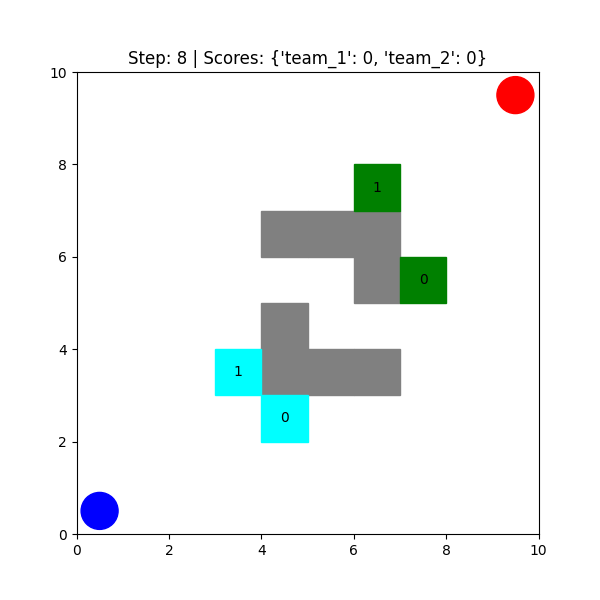
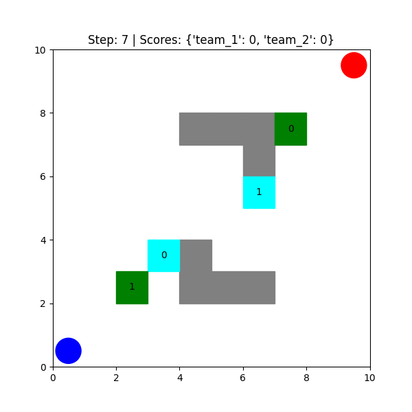
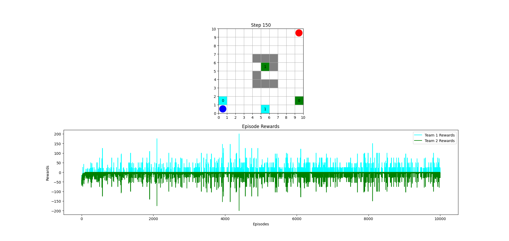
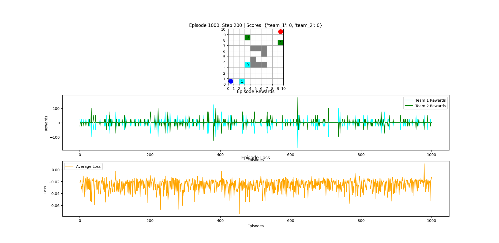
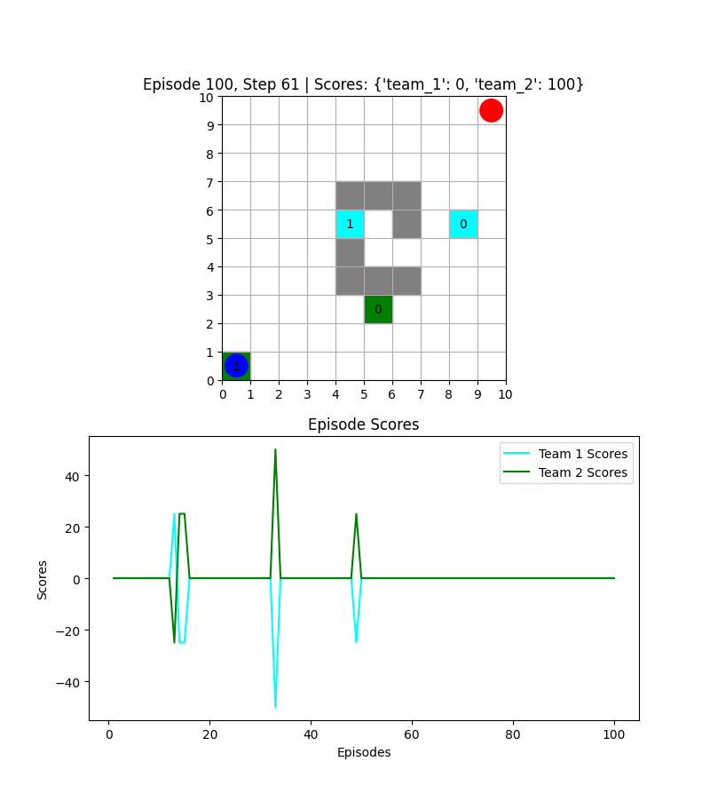
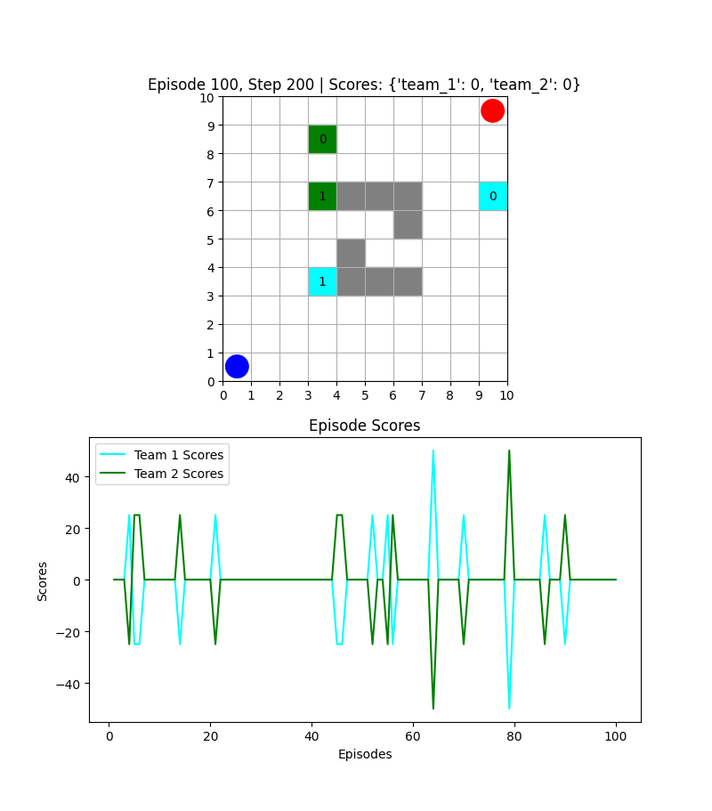

# Multi-Agent Reinforcement Learning (MARL) for Capture The Flag (CTF)

This project implements **Multi-Agent Reinforcement Learning (MARL)** algorithms for the **Capture the Flag (CTF)** game environment. The project evaluates different approaches like **Independent Q-Learning (IQL)**, **Deep Q-Network (DQN)**, and **Multi-Agent Proximal Policy Optimization (MAPPO)** for cooperative and competitive agent interactions in a grid-world environment.

## Table of Contents
- [Introduction](#introduction)
- [Project Structure](#project-structure)
- [Algorithms](#algorithms)
    - [Independent Q-Learning (IQL)](#independent-q-learning-iql)
    - [Deep Q-Network (DQN)](#deep-q-network-dqn)
    - [Multi-Agent Proximal Policy Optimization (MAPPO)](#multi-agent-proximal-policy-optimization-mappo)
- [Installation](#installation)
- [Usage](#usage)
    - [Training Models](#training-models)
    - [Testing Models](#testing-models)
    - [Metrics Recording and Evaluation](#metrics-recording-and-evaluation)
- [Contributing](#contributing)
- [License](#license)

## Introduction

This repository aims to solve the **Capture The Flag** problem using **Multi-Agent Reinforcement Learning** (MARL). The agents are trained to either capture the opponent's flag or defend their own flag in a dynamic environment. The project compares different RL algorithms to identify the most effective approach for this type of cooperative and competitive task.

## Project Structure

- **`env.py`**: The changed environment code for the CTF problem where agents take actions and the game progresses.
- **`env2.py`**: The original environment with additional obstacles and variations in agent movements and flag interactions.
- **`train_iql.py`**: Code for training the **Independent Q-Learning (IQL)** agents, where each agent independently learns and updates its Q-table.
- **`train_dqn.py`**: Code for training the **Deep Q-Network (DQN)**, a deep learning model for value-based reinforcement learning.
- **`train_mappo.py`**: Code for training **Multi-Agent Proximal Policy Optimization (MAPPO)** agents, which is a state-of-the-art policy gradient method for MARL.
- **`test_common.py`**: A unified testing script for evaluating **IQL** and **MAPPO** models, recording their performance, and saving test logs for further analysis.
- **`requirements.txt`**: Lists the Python dependencies required to run the project.

## Algorithms

### Independent Q-Learning (IQL)

**Independent Q-Learning (IQL)** is a simple reinforcement learning technique where each agent learns independently and updates its Q-table based on its experiences without considering other agents' actions.

- **Q-value Update**: Each agent maintains a Q-table with states and actions, and updates its Q-values based on rewards received and the next state.
  
    \[
    Q(s, a) \leftarrow Q(s, a) + \alpha \left[ r + \gamma \max_{a'} Q(s', a') - Q(s, a) \right]
    \]
  
- **Training**: Agents explore the environment, learn from the rewards, and update the Q-table.

#### Key Considerations:
- IQL is **easy to implement** and **serves as a good baseline** for comparing other RL algorithms.
- It can be inefficient in a multi-agent environment since each agent is learning independently, and no cooperation is directly learned between agents.

---

### Deep Q-Network (DQN)

**Deep Q-Network (DQN)** is an extension of Q-learning, where the Q-values are approximated using a neural network instead of a Q-table. The network takes the current state as input and outputs Q-values for each action.

- **Network Architecture**: DQN uses a **neural network** to approximate the Q-function.
  
    \[
    Q(s, a; \theta) \approx Q(s, a)
    \]
  
- **Experience Replay**: DQN uses a **replay buffer** to store and sample past experiences to break correlations between consecutive updates.

- **Target Network**: DQN uses a target network to stabilize training, where the target network is periodically updated with the weights of the main network.

---

### Multi-Agent Proximal Policy Optimization (MAPPO)

**MAPPO** is an extension of **Proximal Policy Optimization (PPO)** for multi-agent settings. It uses a centralized training framework but decentralized execution, allowing agents to learn joint policies while acting independently during inference.

- **Centralized Training, Decentralized Execution**: In MAPPO, agents are trained together in a shared environment, and each agent maintains its own policy, but they act independently during execution.

- **Policy Update**: MAPPO uses a **clipped objective function** to prevent large updates and maintain stable learning.

    \[
    L(\theta) = \mathbb{E} \left[ \min \left( r_t(\theta) A, \text{clip}(r_t(\theta), 1 - \epsilon, 1 + \epsilon) A \right) \right]
    \]

    where \( r_t(\theta) \) is the probability ratio and \( A \) is the advantage function.

---

## Installation

1. Clone the repository:

    ```bash
    git clone https://github.com/Shirish2004/MARL-Project.git
    ```

2. Navigate to the project directory:

    ```bash
    cd MARL-Project
    ```

3. Install the dependencies:

    ```bash
    pip install -r requirements.txt
    ```

## Usage

### Training Models

1. **Training IQL**:
   To train the IQL model, run the following command:

   ```bash
   python train_iql.py
   ```

   This will start training the IQL model on the environment.

2. **Training DQN**:
   To train the DQN model, run:

   ```bash
   python train_dqn.py
   ```

3. **Training MAPPO**:
   To train the MAPPO model, run:

   ```bash
   python train_mappo.py
   ```

### Testing Models

To test and compare the performance of **IQL** and **MAPPO**, run:

```bash
python test_common.py
```

This will:
- Evaluate both IQL and MAPPO on the environment.
- Record the performance metrics (win rates, average scores, etc.).
- Save the test logs for further analysis.

### Metrics Recording and Evaluation

The `test_common.py` script records the following performance metrics:
- **Win Rate**: Percentage of episodes won by each team.
- **Average Score**: Average score for each team.
- **Score Difference**: Difference in scores between the two teams.

The metrics are saved in CSV format and visualized using **matplotlib**.

### Example of Saved Metrics:

- Win rates for both teams
- Average scores for each team over multiple test episodes
- Visualizations of agent movements and scores during testing

## Orignal Environment

## Changed Environment

## Train Results For IQL

## Train Results For MAPPO

## Test Results IQL

## Test Results MAPPO

