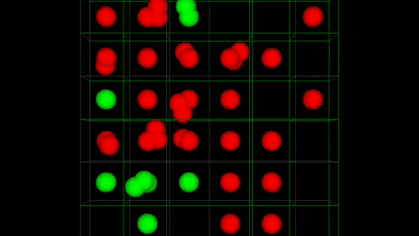

# Using Reinforcement Learning for Chain Reaction Game

The **Chain Reaction** game is a popular strategic multiplayer game where players take turns placing orbs on a grid. The goal is to capture the opponent's cells by triggering chain reactions when the orbs exceed the grid cell's capacity. The game involves strategy, foresight, and adapting to opponents' moves.

  


---

## Implementing PPO and MADDPG for Chain Reaction

### 1. **Proximal Policy Optimization (PPO)**  
PPO is a reinforcement learning (RL) algorithm that uses a single-agent policy optimization approach. Here’s how it applies to the Chain Reaction game:

- **State Representation**: Encodes the game board as input for the agent, including cell ownership and orb count.
- **Action Space**: The agent selects a grid cell for placing an orb.
- **Reward System**:  
  - +100 for winning.
  - -100 for losing. 
  -  +(number of tiles taken away from the opponent)
  Game concludes when when one player has no more remaining orbs on the board.
- **Policy Optimization**: PPO optimizes the policy with a clipped surrogate objective to maintain stable updates.

This approach works for solving single-player or competitive versions where one agent plays against predefined strategies or other PPO agents.

---

### 2. **Multi-Agent Deep Deterministic Policy Gradient (MADDPG)**  
MADDPG extends DDPG to multi-agent settings, enabling agents to learn decentralized policies while sharing a global critic. Here’s how it fits the Chain Reaction game:

- **Agent Structure**: Each player is represented by an independent agent with its policy network.
- **Shared Critic**: A centralized critic evaluates the joint action of all agents, considering the entire game state.
- **Exploration**: Agents explore the game space while balancing competition and cooperation.
- **Reward System**: Similar to PPO but designed to reflect multi-agent dynamics:
  - Reward depends on both personal and opponent moves, encouraging competitive strategies.

MADDPG enables dynamic and adaptive gameplay, where agents learn counterstrategies based on the actions of others.

---

By leveraging PPO and MADDPG, the Chain Reaction game transitions into a robust RL problem, offering insights into multi-agent learning and strategic planning.

## For game demo 

To play the game run the given command. 
```
python Algorithms/game_demo.py
```
In the game board select the square you want to place your piece in. 2 Players can places pieces alternatingly. 


## For training agent

### For MADDPG 

```
python Algorithms/MADDPG/train.py
```

### For PPO

```
python Algorithms/PPO/train.py
```

## For testing against trained agent 

Load the weights from 'Algorithms/MADDPG/checkpoints' or 'Algorithms/PPO/checkpoints' in 'Algorithms/main.py' then run the following:

```
python Algorithms/main.py
```

