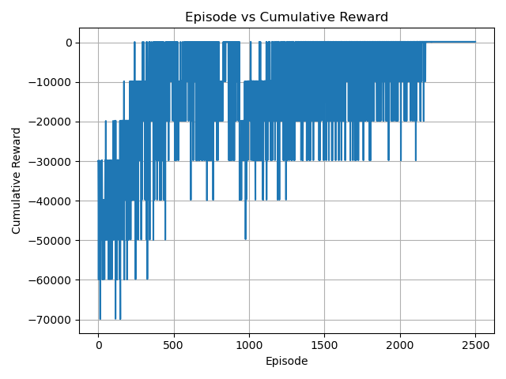

# ModTSP Q-Learning Agent

This project implements a Q-learning agent to solve a modified Travelling Salesman Problem (TSP) using reinforcement learning. The environment is created using Gymnasium, and the agent learns to maximize profits by navigating between targets.

## Environment Variables

The `ModTSP` environment has the following parameters that can be adjusted:

- `num_targets` (int): The number of targets in the environment. Default is 10.
- `max_area` (int): The maximum area within which targets are generated. Default is 15.
- `shuffle_time` (int): Time interval for shuffling the initial profits of targets. Default is 10.
- `seed` (int): Random seed for reproducibility. Default is 42.

## Q-Learning Parameters

The `QLearningAgent` class has several tunable parameters:

- `learning_rate` (float): Rate at which the agent updates its Q-values.  (0.1) is implemented in the code.
- `discount_factor` (float): Discount factor for future rewards.  (0.99) is implemented in the code.
- `epsilon` (float): Initial exploration probability. (0.1) is implemented in the code.
- `epsilon_decay` (float): Factor by which epsilon is reduced after each episode. (0.99) is implemented in the code.

## Performance

After training the agent for 2500 episodes, the final converged value achieved by the agent was **274.054**.

## compariosn plot



## Requirements

To run this code, ensure you have the following packages installed:

- Python 3.x
- NumPy
- Matplotlib
- Gymnasium

You can install the required packages using pip:

```bash
pip install numpy matplotlib gymnasium
