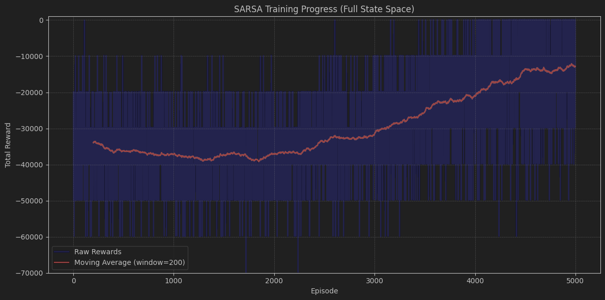
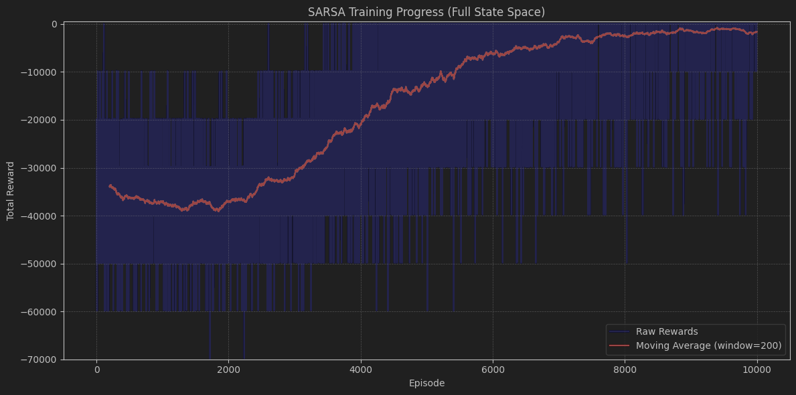
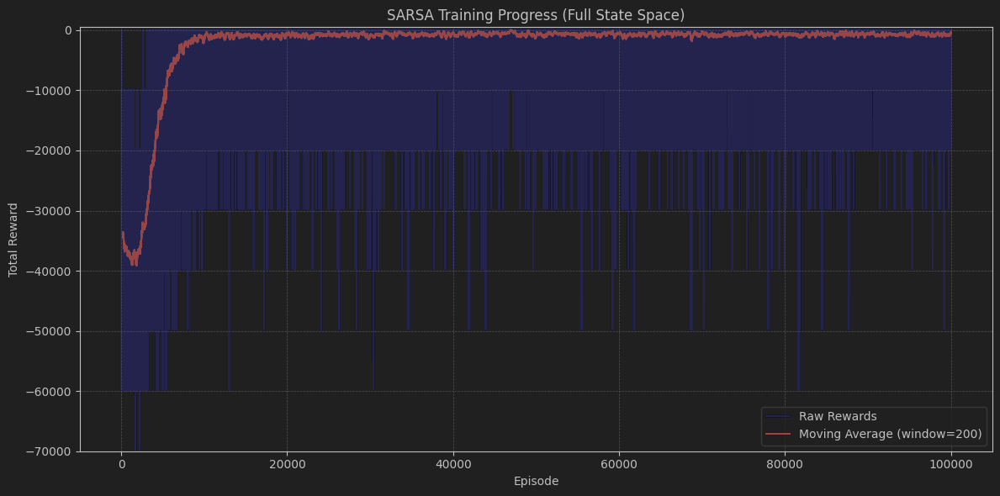
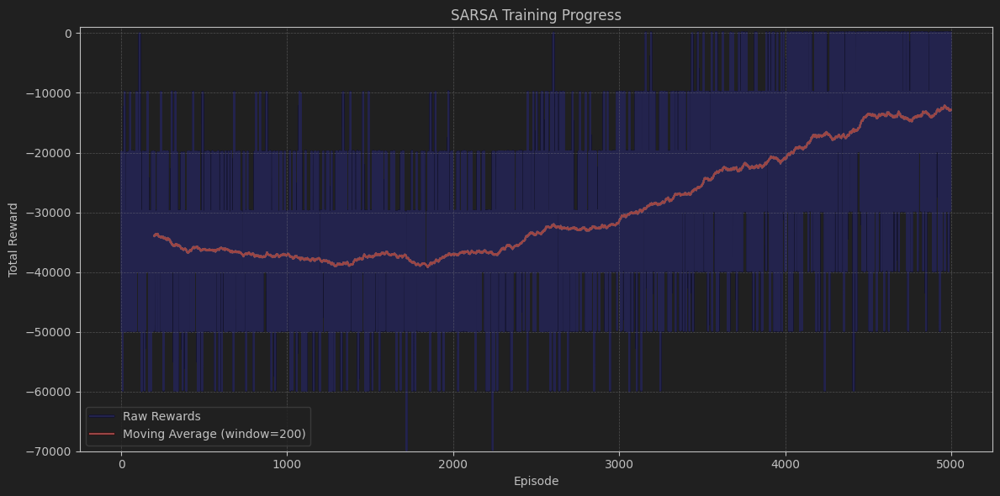
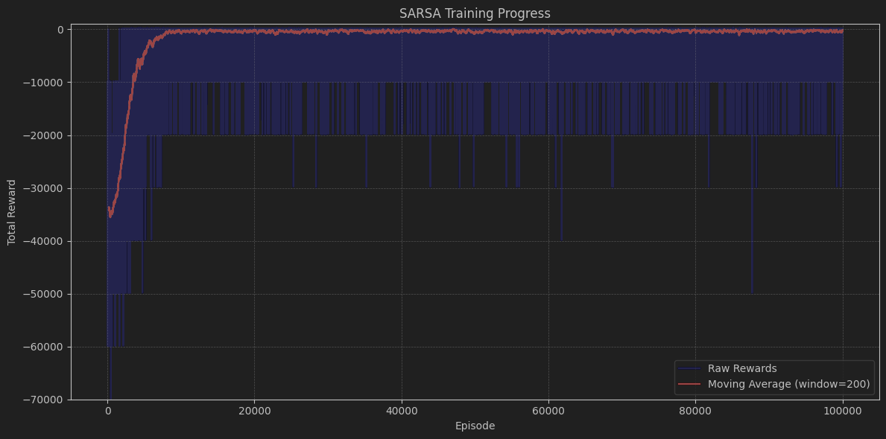
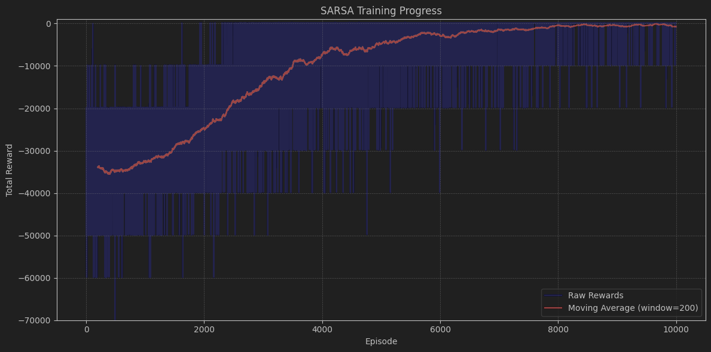

# Mid-Sem Assessment

by Rakshith, 21218 for DSE 627

## 1. Creating the Environment
```conda create -n marl_mid_sem python=3.11```

```conda activate marl_mid_sem```

```pip install gymnasium numpy matplotlib```

## 2. Running the code
Run the individual Cells in the Jupyter notebook to run the SARSA agent.

### The Results given by the model are given below
Using SARSA and Keeping the Number of Episodes to be 5k

Using SARSA and Keeping the Number of Episodes to be 10K

Using SARSA and Keeping the Number of Episodes to be 1 Lakh

```
{
Episode 98600/100000, Total Reward: 78.48450469970703, Epsilon: 0.01
Episode 98700/100000, Total Reward: 78.48450469970703, Epsilon: 0.01
Episode 98800/100000, Total Reward: 78.48450469970703, Epsilon: 0.01
Episode 98900/100000, Total Reward: 78.48450469970703, Epsilon: 0.01
Episode 99000/100000, Total Reward: 78.48450469970703, Epsilon: 0.01
Episode 99100/100000, Total Reward: 78.48450469970703, Epsilon: 0.01
Episode 99200/100000, Total Reward: 78.48450469970703, Epsilon: 0.01
Episode 99300/100000, Total Reward: 78.48450469970703, Epsilon: 0.01
Episode 99400/100000, Total Reward: 78.48450469970703, Epsilon: 0.01
Episode 99500/100000, Total Reward: 78.48450469970703, Epsilon: 0.01
Episode 99600/100000, Total Reward: 78.48450469970703, Epsilon: 0.01
Episode 99700/100000, Total Reward: 78.48450469970703, Epsilon: 0.01
}
```
Using a reduced State space and SARSA with no. of Episodes to be 5K

Using a reduced State space and SARSA with no. of episodes as 1 lakh

```
    {Episode 98700/100000, Total Reward: 122.94517707824707, Epsilon: 0.01
Episode 98800/100000, Total Reward: 122.94517707824707, Epsilon: 0.01
Episode 98900/100000, Total Reward: 122.94517707824707, Epsilon: 0.01
Episode 99000/100000, Total Reward: 122.94517707824707, Epsilon: 0.01
Episode 99100/100000, Total Reward: 122.94517707824707, Epsilon: 0.01
Episode 99200/100000, Total Reward: 122.94517707824707, Epsilon: 0.01
Episode 99300/100000, Total Reward: 122.94517707824707, Epsilon: 0.01
Episode 99400/100000, Total Reward: 122.94517707824707, Epsilon: 0.01
Episode 99500/100000, Total Reward: 122.94517707824707, Epsilon: 0.01
Episode 99600/100000, Total Reward: 122.94517707824707, Epsilon: 0.01
Episode 99700/100000, Total Reward: 122.94517707824707, Epsilon: 0.01
    }
```

Using a reduced State space and SARSA with no. of episodes to be 10k

### HyperParameters used

```learning_rate=0.1```
```discount_factor=0.95```
```epsilon=1.0```
```epsilon_decay=0.995```
```epsilon_min=0.01 ```
    
### Insights

* In all scenarios, the model shows a general trend of improvement over time, as indicated by the increasing moving average of total rewards.

* The raw rewards (blue lines) show high variability, which is expected  due to the exploration-exploitation trade-off.

* Comparing the 5,000 and 10,000 episode runs, we can see that more episodes generally lead to better performance and stability.
 
* The 10,000 episode runs (Images 2 and 4) show a more pronounced upward trend and appear to reach higher reward levels compared to their 5,000 episode counterparts (Images 2 and 4).

* The reduced state space scenarios (Images 1 and 2) seem to have a different learning curve compared to the full state space scenarios (Images 1 and 3).

* In the reduced state space, the initial performance appears worse (lower rewards), but the learning progress is more stable and shows a clearer upward trend.

* While the reduced state space might make the initial learning more challenging, it potentially leads to more consistent improvement over time.

* The high variability in raw rewards, especially in the early episodes, indicates significant exploration.

* As the episodes progress, the moving average becomes smoother, suggesting a shift towards exploitation of learned policies.

* The full state space models show more extreme negative rewards, particularly in early episodes, suggesting they might be more prone to catastrophic failures during learning.

* The reduced state space models seem to have a more constrained range of rewards, possibly indicating more stable, with initial lower, performance.


If you have come this far then here's baabu maan to thank you!


