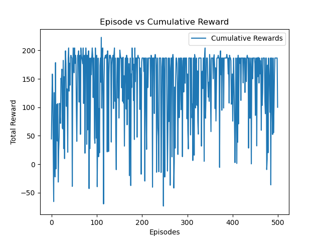
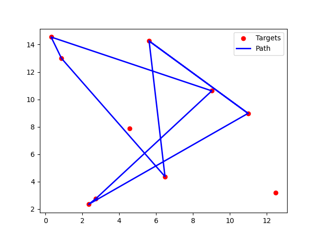

# **Modified Travelling Salesman Problem - SARSA Solution**

This repository contains the solution to the modified Travelling Salesman Problem (TSP) using a **SARSA** reinforcement learning algorithm. The goal of this assignment was to navigate the TSP environment, maximize profits, and ensure that the agent visits all targets. The profit decays with the distance traveled, and the profits of each target are shuffled after every few episodes. The results include the agent's performance in terms of cumulative rewards and a visualization of the agent's path.

## **Results Summary**

The following key results were observed during the training:

1. **Cumulative Rewards**:
   The cumulative rewards over 500 episodes showed a fluctuating pattern, with significant negative rewards at various points due to repeated visits to previously visited targets, which incurred high penalties. The trend suggests that while the agent was able to explore, maximizing profit consistently across episodes remained a challenge.
   
   Here are some notable cumulative reward values across different episodes:
   
   - Episode 0: **-19,902.38**
   - Episode 50: **-29,687.88**
   - Episode 100: **-49,778.82**
   - Episode 150: **-59,774.93**
   - Episode 200: **-9,778.46**
   - Episode 250: **-9,745.61**
   - Episode 300: **-59,827.39**
   - Episode 350: **-49,757.33**
   - Episode 400: **-39,748.29**
   - Episode 450: **-49,743.91**

   

2. **Path Traversal**:
   The agent's path over the target locations is visualized below. The blue line represents the path the agent took, and the red dots represent the targets. While the agent managed to traverse multiple targets, it appears to have revisited certain locations, potentially leading to suboptimal rewards.

   

## **Discussion of Results**

- **Cumulative Reward Trends**: The cumulative reward plot indicates significant variability across episodes. The agent incurs heavy penalties, as shown by large negative reward spikes. This is due to revisits to previously visited targets, which lead to profit decay and penalties. There were some episodes where the rewards improved, suggesting partial learning, but overall, the policy struggled to maintain consistent positive reward maximization.

- **Path Traversal**: The visualized path traversal shows that the agent does not always optimize the sequence in which it visits the targets. This likely contributes to the erratic reward behavior seen in the reward plot. Despite multiple exploration attempts, the agent's learned policy did not fully optimize the route.

## **How to Run the Code**

To run this solution and generate the same results, follow the steps below:

### **1. Clone the Repository**
```bash
git clone https://github.com/yourusername/yourrepository.git
cd yourrepository
```

### **2. Install Dependencies**
Ensure you have the required Python libraries installed. Use the provided `requirements.txt` file:
```bash
pip install -r requirements.txt
```

### **3. Run the Code**
To run the SARSA solution and generate the path traversal and cumulative reward plots:
```bash
python sarsa_sol.py
```

### **4. View Results**
- After running the code, the **cumulative reward plot** will be displayed.
- The **path traversal animation** for the final episode will be saved in the project folder as `tsp_animation.mp4`.


https://github.com/user-attachments/assets/f4531c4c-198f-4077-abf6-63599038b152


You can adjust the number of episodes and other hyperparameters directly in the `sarsa_sol.py` script.

## **Directory Structure**
```plaintext
/yourrepository
│
├── sarsa_sol.py            # SARSA solution for the TSP problem
├── tsp_env.py              # TSP environment implementation
├── README.md               # This README file
├── episodic_cumulative_reward.png  # Cumulative reward plot
├── path_traversal.png              # Path traversal plot
└── tsp_animation.mp4               # Animation of agent's path
└── requirements.txt        # List of dependencies
```

## **Concluding Remarks**
This solution demonstrates the challenges of solving a dynamic TSP using a reinforcement learning approach like SARSA. Future improvements may involve optimizing exploration strategies or modifying the reward function to encourage more optimal sequences and discourage revisits. Adjusting learning parameters (e.g., epsilon, alpha) might also help in stabilizing the learning process.
