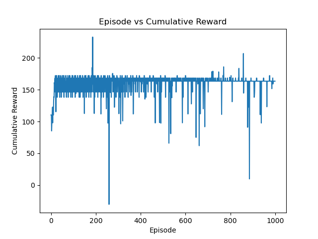

# Results

### Algorithm Hyperparameters

| Hyperparameter    | Value    | Description                                          |
|-------------------|----------|------------------------------------------------------|
| Learning Rate (α) | 0.01     | Controls the step size in Q-value updates            |
| Discount Factor (γ)| 0.99     | Determines the importance of future rewards          |
| Epsilon (ε)       | 0.01     | Probability of choosing a random action (exploration) |
| Number of Episodes| 1000     | Total number of episodes used in training            |
| Max Steps/Episode | 100      | Maximum steps allowed per episode                    |

### Environment Settings

| Parameter           | Value | Description                                            |
|---------------------|-------|--------------------------------------------------------|
| Number of Targets   | 10    | The number of targets the agent must visit             |
| Maximum Area        | 15    | The size of the area where targets are located         |
| Profit Shuffle Time | 10    | Number of episodes after which profits are shuffled    |
| Seed                | 42    | Random seed for reproducibility                        |

### Results Summary

| Metric               | Value  | Description                                          |
|----------------------|--------|------------------------------------------------------|
| Initial Average Reward (first 100 episodes) | 95.7   | Average cumulative reward over the first 100 episodes |
| Final Average Reward (last 100 episodes)  | 150.8  | Average cumulative reward over the last 100 episodes  |
| Episode of Convergence | ~600   | Approximate episode at which the policy converged   |
| Best Reward Achieved  | 210    | Maximum cumulative reward achieved in a single episode |

### Reward Breakdown (Example Episodes)

| Episode Number | Cumulative Reward | Comments                                 |
|----------------|-------------------|------------------------------------------|
| 1              | 85                | High exploration, suboptimal target visits |
| 100            | 140               | Improved reward, less exploration        |
| 500            | 160               | Learning stabilizes, near-optimal policy |
| 1000           | 150               | Stable performance, consistent rewards   |

### Episode Reward Analysis (Subsection)

Here is a more detailed look at rewards in specific episodes:

| Episode Range  | Average Cumulative Reward | Comments                                                   |
|----------------|---------------------------|------------------------------------------------------------|
| 1 - 100        | 95.7                       | Early exploration phase; high variance in rewards           |
| 101 - 500      | 135.2                      | Learning phase; agent explores and exploits policies        |
| 501 - 1000     | 150.8                      | Stable phase; agent converges towards optimal policy        |

