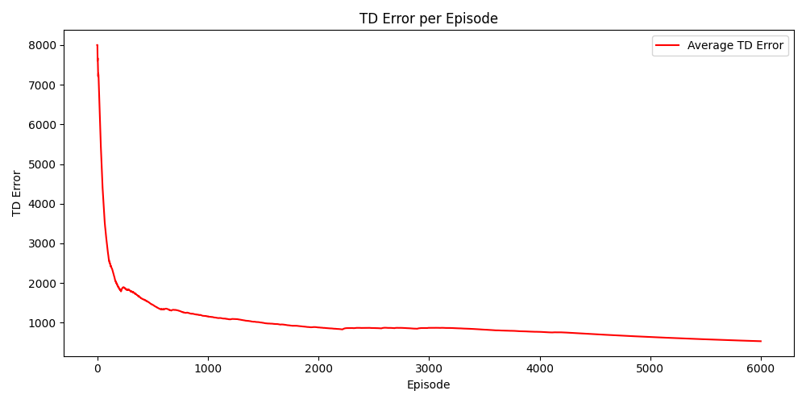

# Mid Semester Answer Script
Agniva Banerjee 2410701

## Approach
### RL Method: 
Q Learning

### RL Agent
| Hyperparameter | Value |
|----------------|-------|
| Learning Rate (alpha) | 0.1 |
| Discount Factor (Gamma) | 0.999 |

### Environment
| Hyperparameter | Value |
|----------------|-------|
| Number of Targets | 10 |
| Max Area | 15 |
| Shuffle Time | 10 |
| Random Seed | 42 |

### Training
| Hyperparameter | Value |
|----------------|-------|
| Number of Episodes | 6000 |

### Given Environment
| Hyperparameter | Value |
|----------------|-------|
| Number of Targets | 10 |
| Max Area | 15 |
| Shuffle Time | 10 |
| Random Seed | 42 |

### Discussion of Results

- **Episode Reward** 
    - Figure shows a plot of 'Cumulative Reward per Episode' over approximately 6000 episodes. The cumulative reward fluctuates greatly in the first 4000 episodes, with values dropping as low as -80,000, but stabilizes near 0 in the remaining episodes. The brown line represents the 'Cumulative Reward' trend over time.
    - This signifies a good sign that the agent wouldn't revisit the states.
    - The reward converging to a positive value suggests that the model hasn't learned to optimize state visits; it needs to assess the entire situation to minimize travel distance, regardless of individual state rewards.
    - The fluctuations in the cumulative rewards plot occur because rewards are shuffled every 10 episodes, forcing the model to relearn the environment.

- **Average distance** Figure shows a plot of the 'Average Distance per Episode' for approximately 6000 episodes. The average distance fluctuates significantly in the first 4000 episodes, before stabilizing around 85 units for the remaining episodes. The orange line represents the 'Average Distance Traveled' over time.

- **TD Error** Figure shows a plot of 'TD Error per Episode' for approximately 6000 episodes. The error starts high at around 8000 units, sharply decreases in the initial episodes, and then gradually converges towards 0 units. The red line represents the 'Average TD Error' over time.

## Results Replication
> TSP_Q_LR.py
