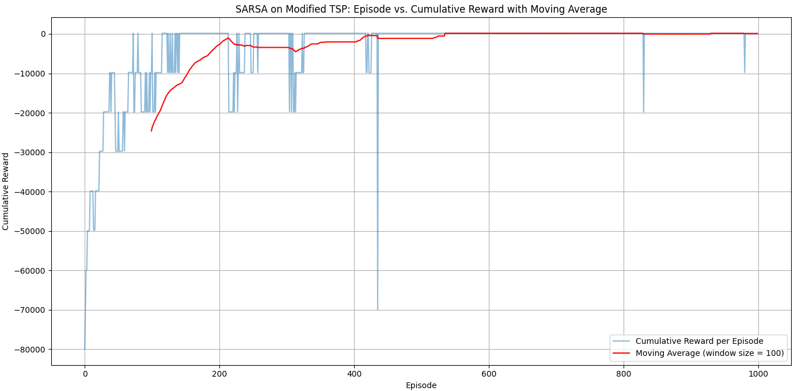
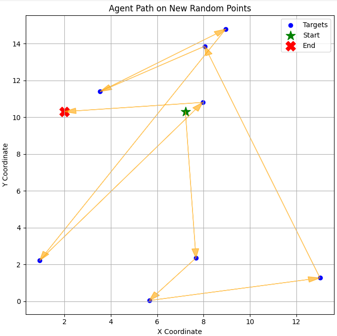

# Modified Traveling Salesman Problem with SARSA

This project implements a Modified Traveling Salesman Problem (TSP) as a reinforcement learning environment using the SARSA (State-Action-Reward-State-Action) algorithm. The agent's goal is to visit a set number of targets while maximizing a profit function.

## SARSA Algorithm

SARSA stands for State-Action-Reward-State-Action, a model-free reinforcement learning algorithm. It is an on-policy method that updates the Q-values (action-value function) based on the actions taken by the agent. SARSA works by following these steps in an episode:

1. **State and Action**: Start in a given state and choose an action based on an epsilon-greedy policy (exploration/exploitation trade-off).
2. **Reward and Next State**: After performing the action, receive a reward and observe the new state.
3. **Next Action**: Choose the next action in the new state using the epsilon-greedy policy.
4. **Update Q-value**: The Q-value for the previous state-action pair is updated using the reward received and the Q-value of the new state-action pair.
5. **Repeat**: This process continues until the episode ends. The agent learns to associate state-action pairs with rewards and refines its policy over multiple episodes.

## SARSA Implementation

The SARSA algorithm is implemented as part of the `ModTSP` environment. Key functions include:
- **choose_action(state)**: Implements an epsilon-greedy policy to select the next action.
- **update_q_value(state, action, reward, next_state, next_action)**: Updates the Q-value based on the SARSA formula.
- **step(action)**: Takes the specified action, transitions to the next state, and returns the reward.

### Parameters:
- `alpha`: Learning rate, controls how much new information overrides old information.
- `gamma`: Discount factor, represents the importance of future rewards.
- `epsilon`: Exploration rate, balances between exploration and exploitation.

## Running the Code

To run the SARSA-based TSP agent, simply execute the `main()` function in the provided python notebook. It trains the agent for a specified number of episodes and plots the learning curve.

## Results

### Training Curve

Below is a sample plot showing the optimal policy for randomly generated points

