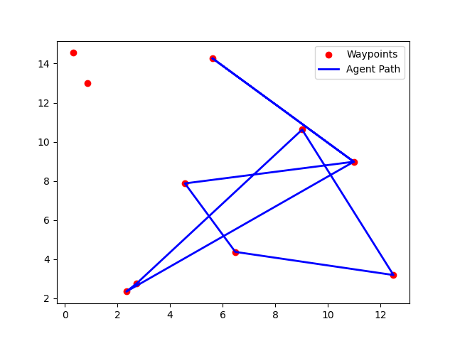

# Q-Learning Agent for Modified Traveling Salesman Problem (TSP)

This repository contains an implementation of a Q-learning agent that solves a modified Traveling Salesman Problem (TSP). The agent learns to navigate through target waypoints to minimize the total travel cost (negative reward). The simulation environment allows shuffling of target positions during episodes.

## Files in this Repository

1. **sol.py**: This file contains the Q-learning agent's implementation and the environment interaction logic.
2. **env.py**: This file contains the TSP environment.
3. **Figure_1.png**: Visualization of the cumulative rewards over 1000 episodes.
4. **Figure_2.png**: Visualization of the agent's path over the waypoints at the final episode.
5. **README.md**: This file provides detailed instructions for running the code and understanding the results.

## Requirements

- Python 3.7+
- Required Libraries:
  - numpy
  - matplotlib
  - ffmpeg (for saving animations)
  - An appropriate environment (`ModTSP`) defined in `env.py`

You can install the necessary Python libraries by running:

```bash
pip install numpy matplotlib gymnasium openai-gym
```

## Running the Code

1. Ensure the environment class `ModTSP` is correctly implemented or imported from the `env.py` file.
2. Run the `sol.py` script using the following command:

```bash
python sol.py
```

This will:
- Train the Q-learning agent for 1000 episodes.
- Display the cumulative rewards after each episode.
- Save the path visualizations and the cumulative reward chart.

## Results

### Cumulative Rewards After 1000 Episodes

The performance of the Q-learning agent over 1000 episodes is plotted in `Figure_1.png`. Here’s a sample of cumulative rewards after key episodes:

```json
{
    'Rewards after episode 0': -19902.38,
    'Rewards after episode 100': -49778.82,
    'Rewards after episode 200': -9778.46,
    'Rewards after episode 300': -59827.39,
    'Rewards after episode 400': -39748.29,
    'Rewards after episode 500': -9726.31,
    'Rewards after episode 600': -9769.94,
    'Rewards after episode 700': 214.47,
    'Rewards after episode 800': -49697.01,
    'Rewards after episode 900': -19689.95
}
```

- **Early Episodes (0-100)**: The agent experiences large negative rewards due to high exploration and the random nature of the environment.
- **Middle Episodes (200-600)**: The agent starts showing signs of improvement but still fluctuates between large negative rewards.
- **Late Episodes (700-900)**: The agent begins to converge to better solutions, achieving a positive reward in episode 700.
  


### Path Visualization

The agent's path over the target waypoints in the final episode is shown in `Figure_2.png`. Red dots indicate the waypoints, and the blue line represents the agent's path.



## Modifying Parameters

You can modify the hyperparameters and experiment with the agent’s behavior:

- **Number of Targets**: Change the number of waypoints the agent needs to visit by adjusting the `num_points` parameter in the code.
- **Number of Episodes**: Change the total training time by adjusting the `total_episodes` parameter.
- **Learning Rate** (`lr`): Modify the agent’s learning rate to control how fast it adapts to new situations.
- **Discount Factor** (`discount`): This parameter controls how much future rewards influence current decisions.

## Visualizations

The code will generate two types of visualizations:

1. **Cumulative Reward Plot**: A plot of the total rewards collected by the agent over all episodes, helping to track the learning progress.
2. **Path Visualization**: A real-time visualization of the agent's path across waypoints in the environment. This path is saved as an MP4 file and displayed at the end of training.

## Limitations and Improvements

- **Exploration**: The agent’s exploration rate decays over time, which means it might get stuck in suboptimal policies. You can adjust the exploration decay factor (`exploration_decay`) to see how it affects learning.
- **Path Quality**: The Q-learning approach may not always yield the globally optimal path. Consider using advanced techniques such as Deep Q-Learning or integrating heuristics like Simulated Annealing or Genetic Algorithms for better performance.
