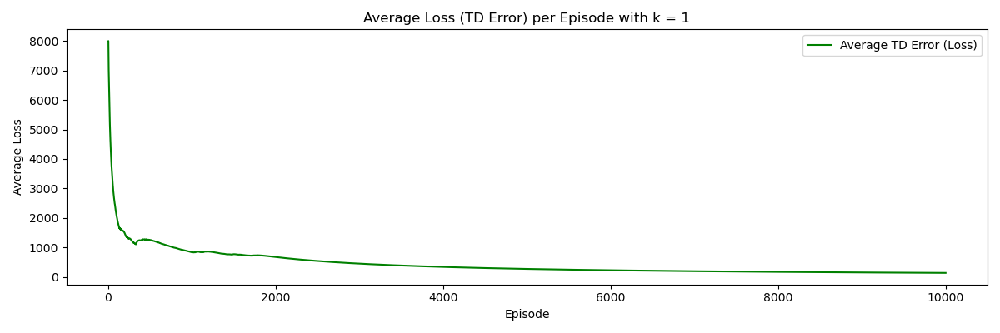
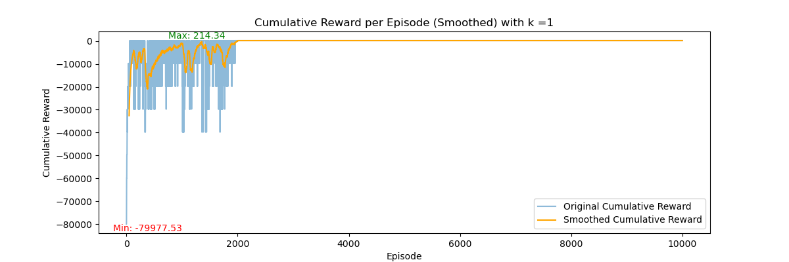
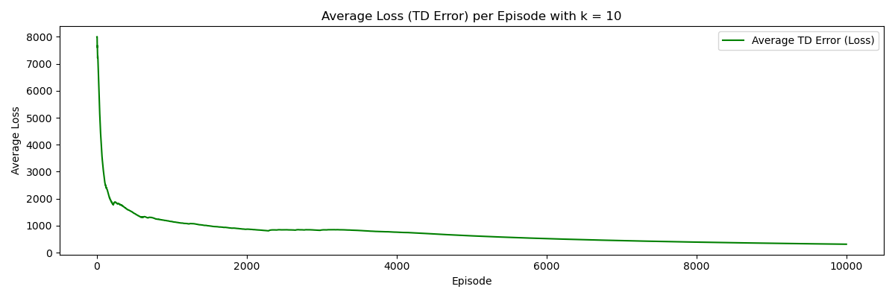
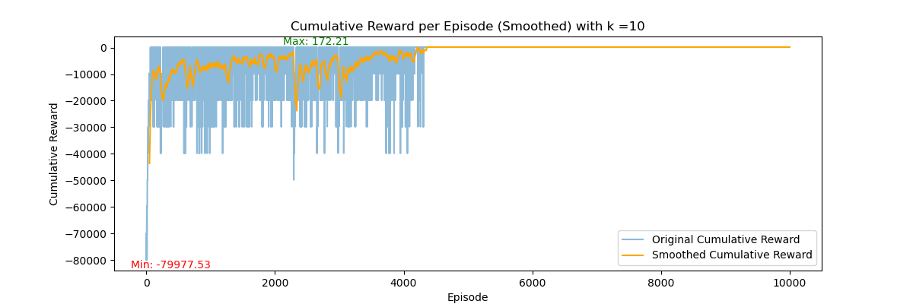
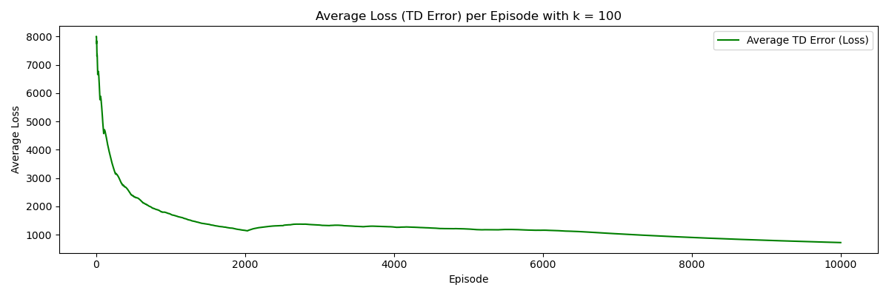
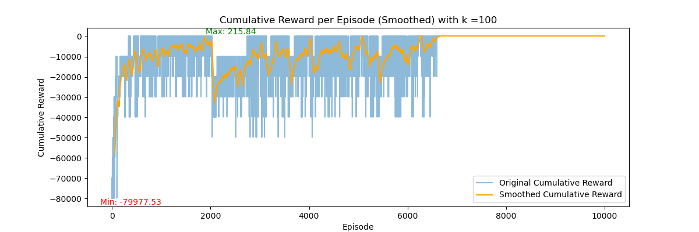
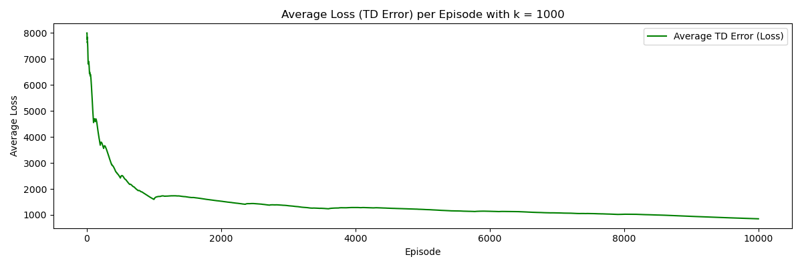
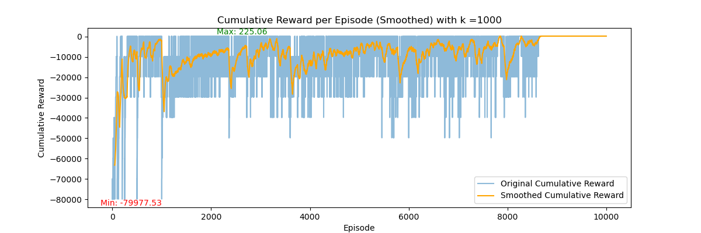
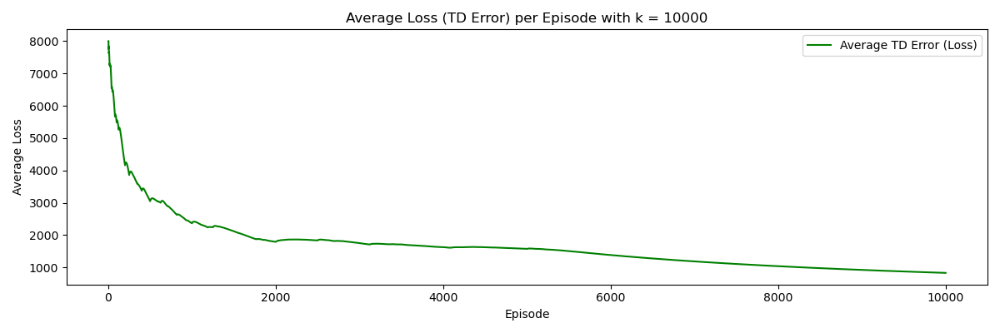
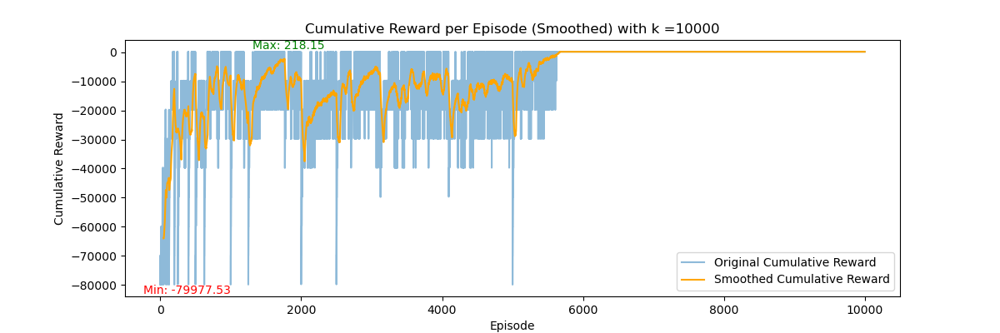

# Mid Semester 
Akshat Singh 20031

## Approach

### Method used: 
Q-learning

A class QLearningAgent is made which does the following things:
 It takes the inputs:

 - num_actions: This is the number of actions which the agent can take, here it is the number of target
 - alpha: the Learning Rate of Q-learning, deafaults to 0.1
 - gamma: The Discount Factor of Reinforcement Learning

And it has the following functions:
 
 - ```choose_action()```: Choose the best action based on the current Q-values (greedy policy)
 - ```update_q_value()```: Update the Q-value for the given state-action pair. This updation is done using the  Q-learning update rule: ```Q(s, a) = Q(s, a) + α \[r + γ max Q(s', a') - Q(s, a)\]```
 - In this equation, Q(s,a) is the Q-value of current step, Q(s',a') is the Q-value of the next state and it's corresponding action
 - The ```q_table``` dictionary is used to track the q-values at each state and its corresponding actions, it is initialized to 0 whenever a new state-action pair is found.
 - The ```td_errors``` list is used to log the errors.
 - Finally in ``` "__main__``` the action is chosen for each step of each episode using ```choose_action()``` until all the cities are visited

### Hyperparameters Summary

### Agent

| Hyperparameter | Value |
|----------------|-------|
| Learning Rate (α) | 0.1 |
| Discount Factor (γ) | 0.99 |


### Environment

| Hyperparameter | Value |
|----------------|-------|
| Number of Targets | 10 |
| Max Area | 15 |
| Shuffle Time | 1 & 10 & 100 & 1000 & 10000  |
| Random Seed | 42 |

### Training

| Hyperparameter | Value |
|----------------|-------|
| Number of Episodes | 10^4 |

## Results

### k = 1





### k = 10





### k = 100





### k = 1000





### k = 10000





### Discussion of Results

- **Loss** 
    - Average Loss is decreasing with episode count.

- **Episode Reward** 
    - Initially starting with a reward of -80,000. 
    - Converges at reward 172.
    - Converging to Positive reward means that the agent is not revisiting any city.
    - Since the reward is p_i  - dist_so_far(), it means that it is also reducing the total distance travelled.
    - Since the reward is being suffled, it converging to a positive value means it just hasn't learned which cities to travel, but also to asses the whole situation and then travel to cities in an order which reduces the distance travelled dispite the rewards earned at that city.
    - This is the reason for the dips in cumulative rewards plot as the rewards are suffled every 10 episode so it has to learn the environment regardless of the rewards.
- ***Shuffle Time***
    - Some interesting results occur when changing shuffle time (k)
    - Initially when k = 1, i.e. when the rewards are shuffled every episode, the cumulative reward converges at 214
    - when k = 10, it reduces to only 172
    - However, at k = 100, it increases to 215 and further increases to 225 at k = 1,000
    - At k = 10,000 for 10,000 episodes, that is when no shuffling is done, it converges to 218
    - This suggests that if we further train at k = 10,000 with large number of episodes, it might converge to an even higher value

## Results Replication
In the ```__main___``` function of ```modified_tsp.py```, change the ```shuffle_time``` variable to your desired value and run the following script
>python modified_tsp.py

This will train the model and store the results in ```output_k_{k}.csv```, where {k} is the value of shuffle time provided, the plots of which can be seen by changing the value of ```k``` to your desired value and running the following script
>python plots.py

Requirements:
- numpy
- gymnasium
- matplotlib
- pandas
