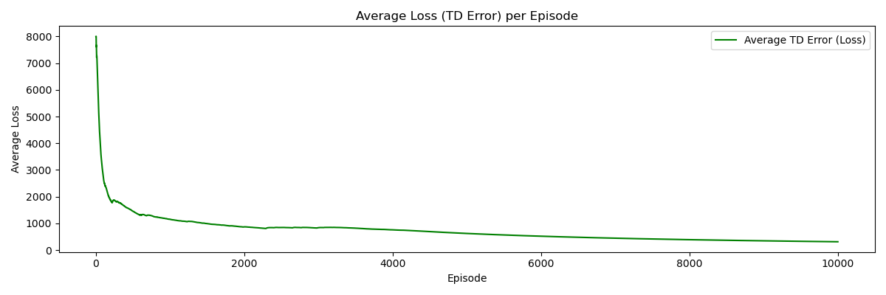
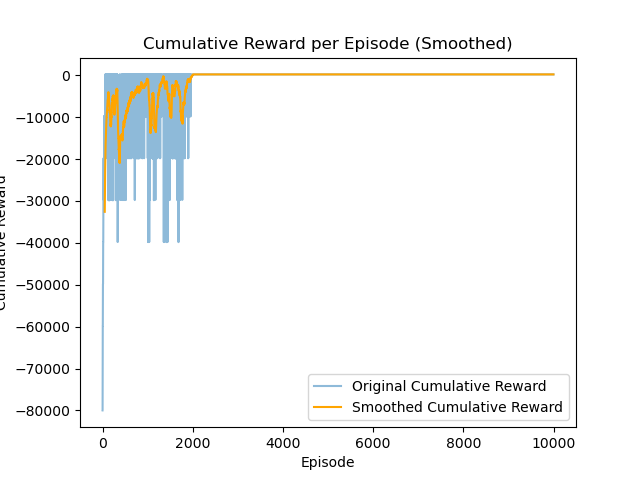

# Mid Semester 
Akshat Singh 20031

## Approach

### Method used: 
Q-learning

### Hyperparameters Summary

### Agent

| Hyperparameter | Value |
|----------------|-------|
| Learning Rate (α) | 0.1 |
| Discount Factor (γ) | 0.99 |


### Environment

| Hyperparameter | Value |
|----------------|-------|
| Number of Targets | 10 |
| Max Area | 15 |
| Shuffle Time | 10 |
| Random Seed | 42 |

### Training

| Hyperparameter | Value |
|----------------|-------|
| Number of Episodes | 10^4 |

## Results






### Discussion of Results

- **Loss** 
    - Average Loss is decreasing with episode count.

- **Episode Reward** 
    - Initially starting with a reward of -80,000. 
    - Converges at reward 172.
    - Converging to Positive reward means that the agent is not revisiting any city.
    - Since the reward is p_i  - dist_so_far(), it means that it is also reducing the total distance travelled.
    - Since the reward is being suffled, it converging to a positive value means it just hasn't learned which cities to travel, but also to asses the whole situation and then travel to cities in an order which reduces the distance travelled dispite the rewards earned at that city.
    - This is the reason for the dips in cumulative rewards plot as the rewards are suffled every 10 episode so it has to learn the environment regardless of the rewards.


## Results Replication
>python modified_tsp.py

This will train the model and store the results in ```output.csv```, the plots of which can be seen by 
>python plots.py

Requirements:
- numpy
- gymnasium
- matplotlib
- pandas
