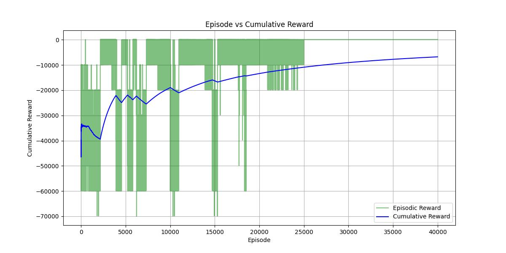

# MIDSEM
## Question: Solve Modified TSP using SARSA

### Hyperparameters used
> - epsilon = 0.9 ( epsilon is constant only over an episode and decays over episodes )
> - decay_function = epsilon ^ (1.01^(ep_num/500))
> - gamma = 0.9
> - alpha = 0.001

### For running the code
```bash
python3 -m venv .venv
source .venv/bin/activate
pip3 install -r .\requirements.txt
python3 -m modified_tsp
```
### The Values Obtained from running the code

- converged reward value = 202.52033638954163
- mean reward value = -4062.697492606985

### The cumulative vs episodic reward graph
 
