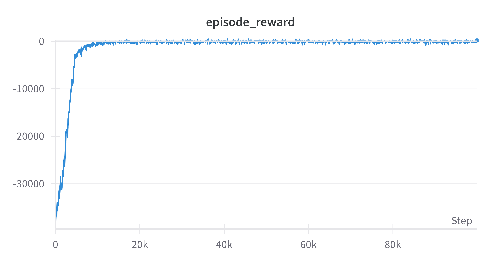

# Mid Semester 
Agamdeep Singh 20021

## Approach
### Method used: 
Deep Q-Network (DQN)
 
### Hyperparameters Summary

### DQN Architecture
| Layer Type | Dimension |
|----------------|-------|
| Input Layer(state space) | 41 units |
| Hidden Layer 1 | 256 units |
| Hidden Layer 2 | 256 units |
| Hidden Layer 3 | 256 units |
| Output Dimensions(# action) | 10 |

### Agent
| Hyperparameter | Value |
|----------------|-------|
| Learning Rate | 0.0005 |
| Gamma (Discount Factor) | 0.99 |
| Optimizer | Adam |
| Loss Function | Smooth L1 Loss |
| Gradient Clipping | Max norm 1.0 |

### Environment
| Hyperparameter | Value |
|----------------|-------|
| Number of Targets | 10 |
| Max Area | 15 |
| Shuffle Time | 10 |
| Random Seed | 42 |

### Training
| Hyperparameter | Value |
|----------------|-------|
| Number of Episodes | 10^5 |
| Max Steps per Episode | 10 |
| Replay Memory Capacity | 10^5 |
| Batch Size | 10^2 |
| Min Epsilon | 0.01 |
| Max Epsilon | 0.7 |
| Epsilon Decay Rate | 0.0005 |
| Target Network Update Frequency | Every 30 episodes |

### Environment
| Hyperparameter | Value |
|----------------|-------|
| Number of Targets | 10 (default) |
| Max Area | 15 (default) |
| Shuffle Time | 10 (default) |
| Random Seed | 42 (default) |
| Max Steps | Equal to number of targets |
| Initial Profits | Range from 10 to 100 (increments of 10) |

## Results

### Discussion of Results
- **Average distance** per episode went down as training proceeding, this is a good thing as shorter paths weakly correalte to profit maximisation. This is due to the fact that longer path will allow profits to decay more.

- **Loss** The picture says everything that needs to be said.

- **Episode Reward** 
    - The reward has actually gone up to be positive, which is amazing. 
    - This is amazing because that the agent is able to visit all cities before the profit decays enough to become negative.
    - Positive rewards also mean the agent is not revisting nodes, as that has a huge negative reard.
    - The ocasional dip in reward to -10000 is because the model still has a 0.01 probability to choose a random city. The probability of the random city being one that has already been visited is non-zero. Leading to -10000 reward.

- Other thoughts
    - You can easily decrease the number of episodes by an oorder of a magintue. The model convered a lot earlier.

## Results Replication
>python modified_tsp.py

Requirements:
- Pytorch
- wandb(for logging)
- numpy etc.