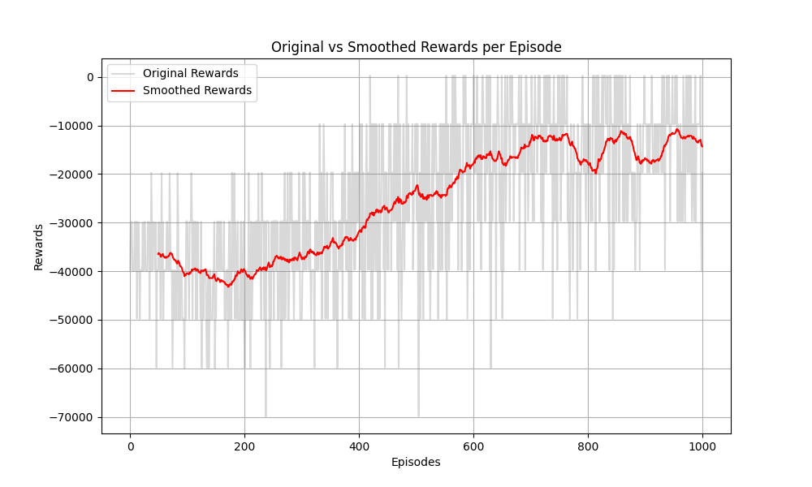

# Q-Learning for Modified Travelling Salesman Problem (TSP) - Report

## 1. Introduction

This project implements a **Q-learning algorithm** to solve a modified version of the **Travelling Salesman Problem (TSP)**, where the agent must visit a set of targets to maximize the total profit. The profits decay over time based on the distance traveled. The primary objective of this project was to apply **Reinforcement Learning (RL)** to optimize the agent's sequence of visits and evaluate the performance through total rewards.

This README serves as a detailed report of my findings, results, and instructions for running and replicating the code.

---

## 2. Results Summary

### 2.1 Problem Overview

The problem involves visiting 10 targets placed randomly on a 2D grid, where each target has a specific profit value. The profit values decay linearly as the agent travels between locations. The challenge is for the agent to maximize the total reward (sum of profits) by visiting all targets in an optimal sequence.

### 2.2 Q-Learning Performance

Using the **Q-learning** algorithm, I trained the agent over 1000 episodes. The performance was evaluated based on the total reward collected per episode. Over time, the agent successfully learned to visit the targets more efficiently, leading to a higher cumulative reward as the training progressed.

#### Key Observations:
- **Early Episodes**: The agent initially performs poorly due to random exploration, resulting in low rewards and inefficient paths.
- **Exploration vs. Exploitation**: As the training continues, the exploration rate (`epsilon`) decays, and the agent starts to exploit the learned Q-values, leading to more optimal routes.
- **Convergence**: Around the 400th episode, the agent's performance stabilizes, with consistently higher rewards, indicating convergence to an optimal or near-optimal policy.
  

#### Performance Plot:
Below is a graph illustrating the agent’s learning progress over 1000 episodes:

- **Original Rewards**: The immediate rewards for each episode.
- **Smoothed Rewards**: A moving average over episodes to show the general trend.



From the plot, it's clear that the agent's performance improves steadily and converges towards higher rewards.

I have also attached a graph showing agent's learning progression over 500 episodes for better understanding.


### 2.3 Discussion

The Q-learning agent learned an efficient strategy for the TSP problem, balancing exploration and exploitation. Early episodes saw significant variance in rewards due to high exploration, but this gradually reduced as the agent learned more about the environment. The use of the epsilon-greedy strategy ensured that the agent explored enough before exploiting the learned knowledge.

Given the simplicity of the environment and the discrete nature of the problem, Q-learning is well-suited to this task. However, more complex TSP problems (with more targets or dynamic profit structures) might benefit from more advanced algorithms such as **Deep Q-Networks (DQN)** or **SARSA**.

---

## 3. How to Run and Replicate the Code

### 3.1 Prerequisites

To run the project, you need to have the following installed:
- **Python 3.x**
- **gymnasium**: A toolkit for developing and comparing reinforcement learning algorithms.
- **numpy**: Library for numerical operations in Python.
- **matplotlib**: For plotting the performance graphs.

You can install the required dependencies by running:

```bash
pip install -r requirements.txt

```

### 3.2 Running the Code

To run the Q-learning agent and visualize the results, follow these steps:

1. **Clone the repository**:
   ```bash
   git clone https://github.com/yourusername/qlearning-tsp.git
   cd qlearning-tsp
   ```

2. **Run the Q-learning agent**:
   ```bash
   python Agent.py
   ```

   This script will:
   - Train the Q-learning agent for a specified number of episodes (default: 1000).
   - Output the total reward for each episode.

3. **View the Performance Plot**:
   After training, the script will generate a plot that shows the total rewards per episode and the smoothed moving average.

### 3.3 Code Structure

```
.
├── qlearning_agent.py        # Main script with the Q-learning implementation and training
├── environment.py            # Optional: Environment implementation for the Modified TSP
├── requirements.txt          # List of dependencies
└── README.md                 # This README file
```

### 3.4 Customizing Parameters

The Q-learning agent's hyperparameters can be customized directly within the `qlearning_agent.py` script. Key parameters include:

- `alpha`: Learning rate (default: `0.1`).
- `gamma`: Discount factor (default: `0.99`).
- `epsilon`: Initial exploration rate (default: `1.0`).
- `epsilon_decay`: Decay rate of `epsilon` over episodes (default: `0.995`).
- `epsilon_min`: Minimum value for `epsilon` (default: `0.01`).
- `num_episodes`: Number of episodes to train the agent (default: `1000`).
- `max_steps_per_episode`: Maximum steps allowed in each episode (default: `100`).

Modify these parameters as needed to experiment with the learning behavior.

---

## 4. Detailed Algorithm Explanation

### 4.1 Q-Learning Algorithm

**Q-learning** is a model-free reinforcement learning algorithm that seeks to find the optimal policy by learning the value of state-action pairs. The agent updates its Q-values using the following rule:

\[
Q(s, a) \leftarrow Q(s, a) + \alpha \left( r + \gamma \max_a Q(s', a) - Q(s, a) \right)
\]

Where:
- \( s \) is the current state.
- \( a \) is the action taken.
- \( r \) is the reward received after taking action \( a \).
- \( s' \) is the next state.
- \( \alpha \) is the learning rate.
- \( \gamma \) is the discount factor.

### 4.2 Epsilon-Greedy Policy

The agent follows an **epsilon-greedy policy**, which balances exploration (random action selection) and exploitation (choosing the best action based on the current Q-values). Over time, the exploration rate (`epsilon`) decays, making the agent rely more on its learned Q-values.

---

## 5. Conclusion

This project demonstrates how the Q-learning algorithm can be applied to a modified Travelling Salesman Problem in a reinforcement learning framework. The agent successfully learned to optimize its path to maximize rewards by balancing exploration and exploitation. 

Potential future work includes:
- Testing more advanced RL algorithms such as **SARSA** or **DQN**.
- Applying the algorithm to more complex TSP problems or other domains with similar characteristics.

Feel free to experiment with the provided code and modify the hyperparameters to explore different learning behaviors!

---

