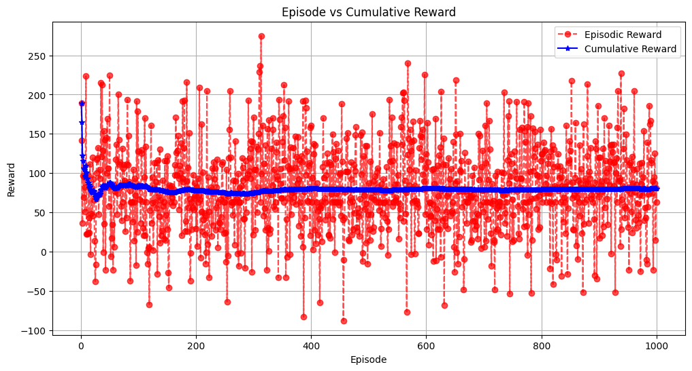
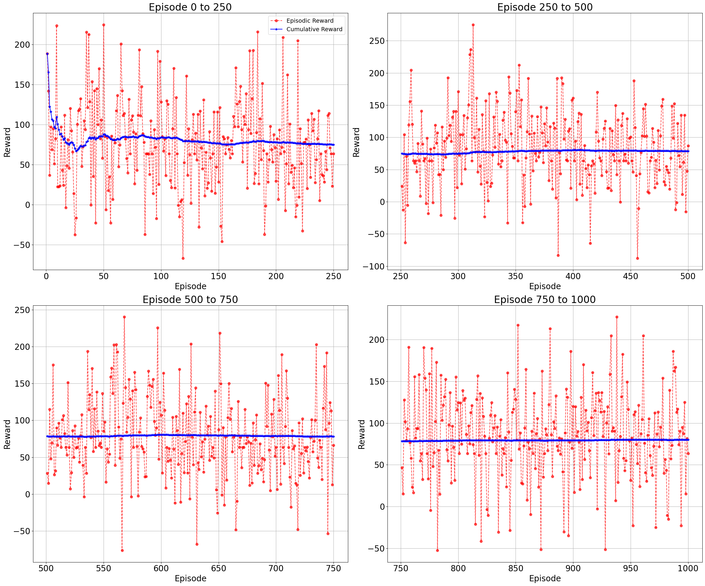

# Multi-Agent Reinforcement Learning - Mid Semester Examination
## Name: Aditya Mishra
## Roll Number: 21013

## Question
You are tasked with modelling and solving a modified version of the Travelling Salesman Problem (TSP) as a reinforcement learning (RL) problem. In this version of TSP, each target has an associated profit value that decays linearly with time such that:

p(i) = p(i) − dist_so_far()

where p(i) is the profit of the target and dist_so_far() is the distance travelled. There are a total of 10 targets. The locations of the targets are fixed, but the profit values are shuffled across the targets after every k episodes. Your task is to visit each target in a sequence to maximize the total collected profit.

## Alogorithm Used
We try to implement both Q-Learning and SARSA. However, Q-Learning did not converge and had high variance in rewards. On the other hand, SARSA converges for us, hence we use it for solving the modified TSP.

## Results
Maximum Reward Attained: 190.90 and Reward at Convergence: 64.48

## Plots
Here are some visualizations of the rewards collected during training:

### Episodic Reward vs Cumulative Reward (Convergence)

### Episodic Reward vs Cumulative Reward (Convergence)

## How to run?
The tsp.py file contains the code for running the environment, which is designed to work in conjunction with the sarsa.py file (where the SARSA class is implemented). Additionally, a Python notebook is provided that outlines the steps required to execute the code and obtain the results.

## Implementation Details
The code were run on Google Colab.

