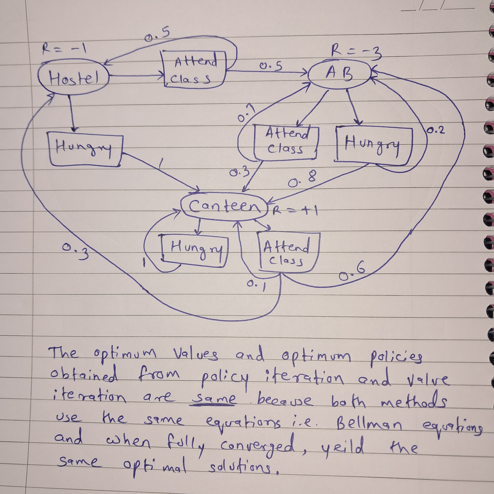
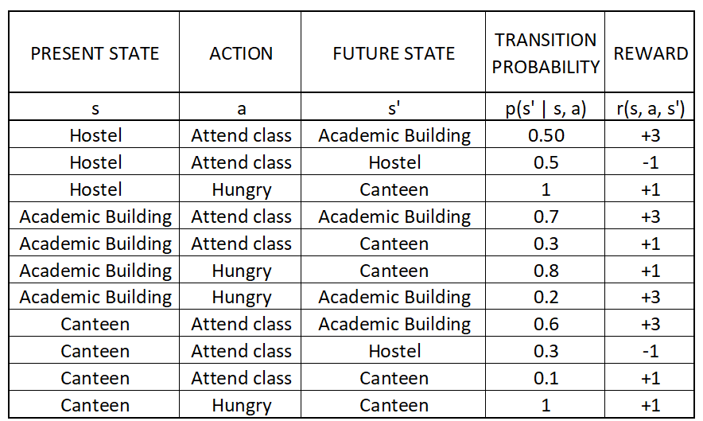
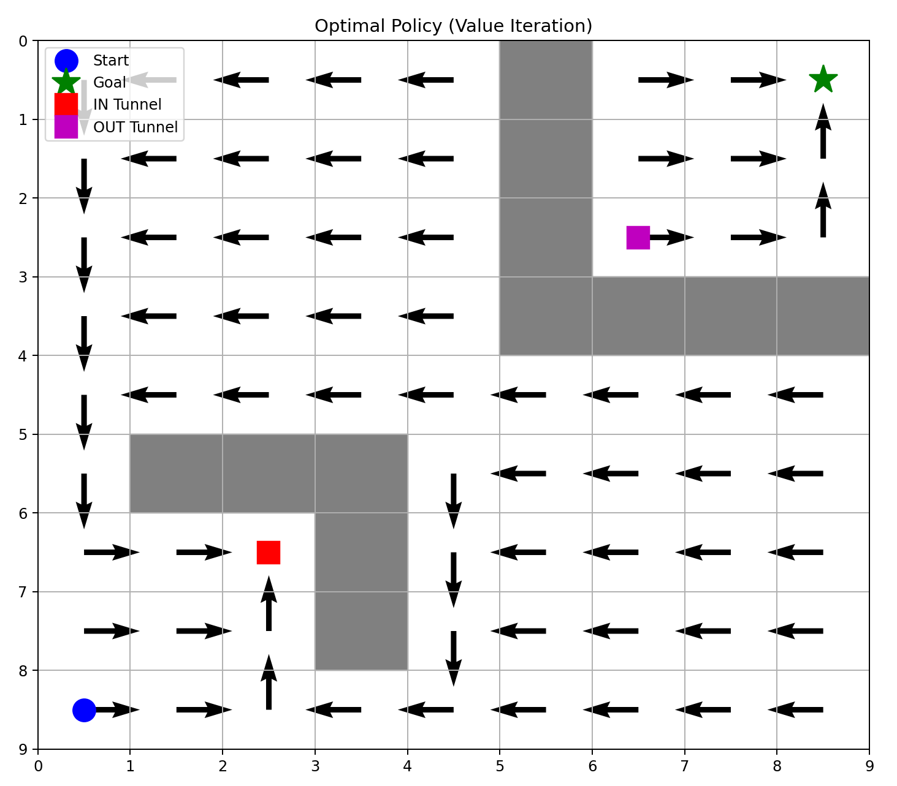
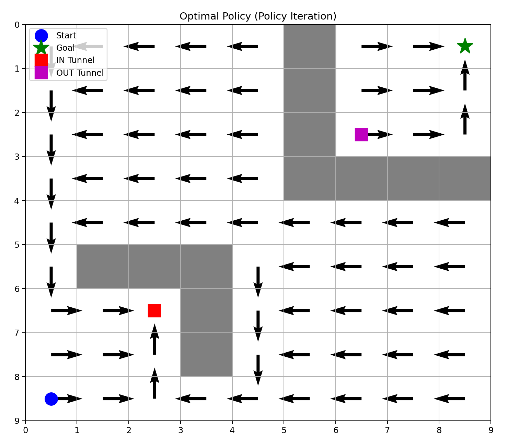

# marl-ecs-course
## Assignment 1

## Usage
 To reproduce the output, just clone this branch and run the python file Q1.py for 1st question and Q2.py for 2nd question.
    
Q1

       python3 Q1.py
   
Q2

       python3 Q2.py

### Q1

### According to Value Iteration:

##### Optimal Values:

Value of state H: 18.95

Value of state A: 20.94

Value of state C: 19.81

#### Optimal Policy:

Policy for state H: Attend_Class

Policy for state A: Attend_Class

Policy for state C: Attend_Class

### According to Policy Iteration:

#### Optimal Values:

Value of state H: 18.95

Value of state A: 20.94

Value of state C: 19.81

#### Optimal Policy:

Policy for state H: Attend_Class

Policy for state A: Attend_Class

Policy for state C: Attend_Class

Where H = Hostel, A = Academic Building, C = Canteen

The optimum values and optimum policies obtained from policy iteration and value iteration are same. Because, both methods use the same equation i.e. Bellman's equations and when fully converged, yield the same optimal solutions.

### Q2

### Value Function (Value Iteration):

[[0.3138106  0.28242954 0.25418658 0.22876792 0.20589113 0.  0.9        1.         0.        ]

 [0.34867844 0.3138106  0.28242954 0.25418658 0.22876792 0.  0.81       0.9        1.        ]
 
 [0.38742049 0.34867844 0.3138106  0.28242954 0.25418658 0.  0.729      0.81       0.9       ]
 
 [0.43046721 0.38742049 0.34867844 0.3138106  0.28242954 0.  0.         0.         0.        ]
 
 [0.4782969  0.43046721 0.38742049 0.34867844 0.3138106  0.28242954  0.25418658 0.22876792 0.20589113]
 
 [0.531441   0.         0.         0.         0.34867844 0.3138106  0.28242954 0.25418658 0.22876792]
 
 [0.59049    0.6561     0.6561     0.         0.38742049 0.34867844  0.3138106  0.28242954 0.25418658]
 
 [0.531441   0.59049    0.6561     0.         0.43046721 0.38742049  0.34867844 0.3138106  0.28242954]
 
 [0.4782969  0.531441   0.59049    0.531441   0.4782969  0.43046721  0.38742049 0.34867844 0.3138106 ]]

### Value Function (Policy Iteration):

[[0.3138106  0.28242954 0.25418658 0.22876792 0.20589113 0.  0.9        1.         0.        ]

 [0.34867844 0.3138106  0.28242954 0.25418658 0.22876792 0.  0.81       0.9        1.        ]
 
 [0.38742049 0.34867844 0.3138106  0.28242954 0.25418658 0.  0.729      0.81       0.9       ]
 
 [0.43046721 0.38742049 0.34867844 0.3138106  0.28242954 0.  0.         0.         0.        ]
 
 [0.4782969  0.43046721 0.38742049 0.34867844 0.3138106  0.28242954  0.25418658 0.22876792 0.20589113]
 
 [0.531441   0.         0.         0.         0.34867844 0.3138106  0.28242954 0.25418658 0.22876792]
 
 [0.59049    0.6561     0.6561     0.         0.38742049 0.34867844  0.3138106  0.28242954 0.25418658]
 
 [0.531441   0.59049    0.6561     0.         0.43046721 0.38742049  0.34867844 0.3138106  0.28242954]
 
 [0.4782969  0.531441   0.59049    0.531441   0.4782969  0.43046721  0.38742049 0.34867844 0.3138106 ]]

### Optimum policy obtained from policy iteration:

[[2 1 1 1 1 2 0 0 4]

 [2 1 1 1 1 0 0 0 3]
 
 [2 1 1 1 1 3 0 0 3]
 
 [2 1 1 1 1 1 3 2 0]
 
 [2 1 1 1 1 1 1 1 1]
 
 [2 0 0 0 2 1 1 1 1]
 
 [0 0 4 0 2 1 1 1 1]
 
 [0 0 3 1 2 1 1 1 1]
 
 [0 0 3 1 1 1 1 1 1]]

### Optimum policy obtained from value iteration:

[[2 1 1 1 1 4 0 0 4]

 [2 1 1 1 1 4 0 0 3]
 
 [2 1 1 1 1 4 0 0 3]
 
 [2 1 1 1 1 4 4 4 4]
 
 [2 1 1 1 1 1 1 1 1]
 
 [2 4 4 4 2 1 1 1 1]
 
 [0 0 4 4 2 1 1 1 1]
 
 [0 0 3 4 2 1 1 1 1]
 
 [0 0 3 1 1 1 1 1 1]]
