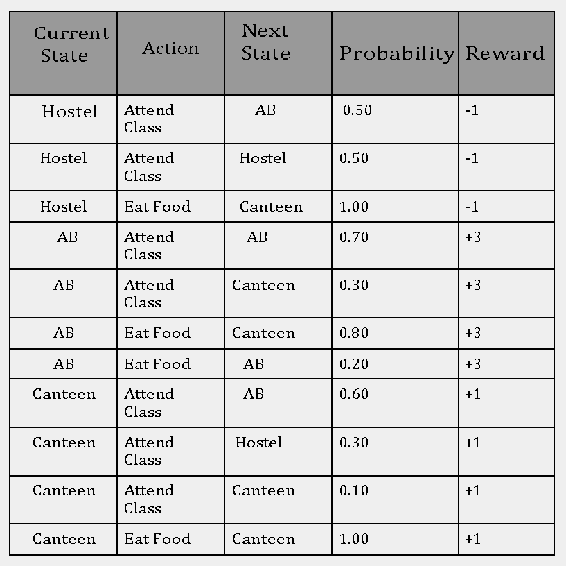
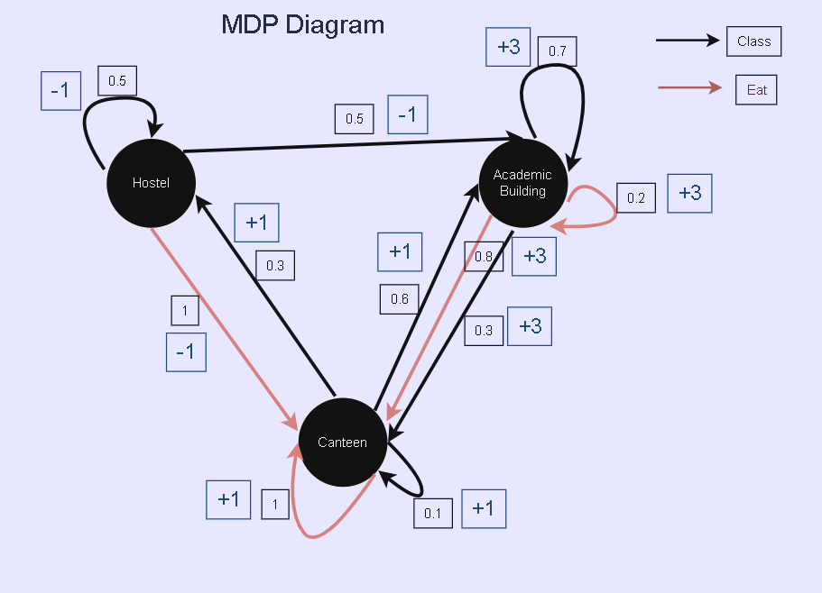
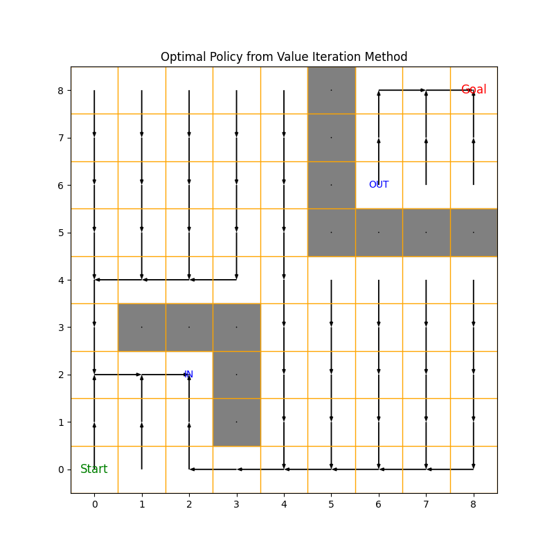

# Assignment 1 Report

- In order to test the code you need to download the code from the source repository or can clone the branch from the source repository.
- Requirements to run the code : numpy and matplotlib library

## Q.1

### Transition Probability Table

### MDP Diagram

- Black box : Transition Probabilty Values
- Blue Box : Reward Values of Transitions

#### Results of the Q1 code 

### Optimal Values and Policy With Value Iteration

### Optimal Values:
- Hostel: 18.951369393117425
- Academic Building: 20.94056457250515
- Canteen: 19.807443641628296

### Optimal Policy (Value Iteration):
- Hostel: Attend Class
- Academic Building: Attend Class
- Canteen: Attend Class

### Optimal Values and Policy With Policy Iteration

### Optimal Values :
- Hostel: 18.951296839417154
- Academic Building: 20.940492018804882
- Canteen: 19.807371087928026

### Optimal Policy (Policy Iteration):
- Hostel: Attend Class
- Academic Building: Attend Class
- Canteen: Attend Class

### Comparison
- The policies from Value Iteration and Policy Iteration resulted out to be same.

### Q.2

### Result of Quiver Plot in PNG Formate

