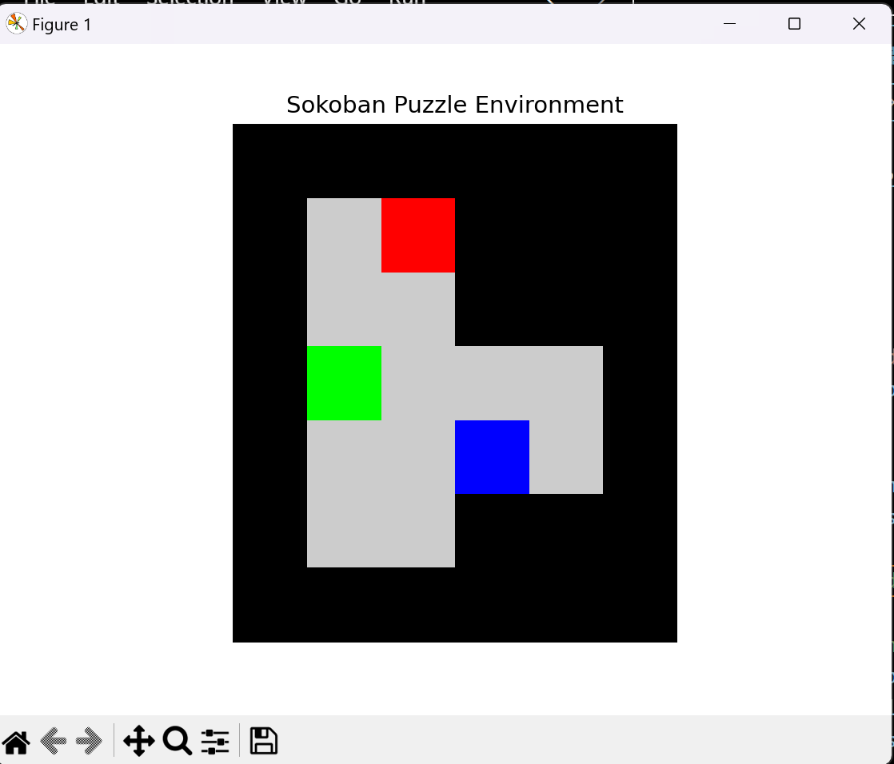

# Assignment 2

## Q1

### Dynamic programming

Usage: 

    python3 tst_dp.py

Output:

Episode 0,  
Q-values: [[-1000. -1000. -1000. ...     0.     0.     0.]  
 [-1000.     0.     0. ...     0.     0.     0.]  
 [-1000.     0.     0. ...     0.     0.     0.]  
 ...  
 [    0.     0.     0. ...     0.     0.     0.]  
 [    0.     0.     0. ...     0.     0.     0.]  
 [    0.     0.     0. ...     0.     0.     0.]]  
 
Episode 100, Q-values: [[-3940.399 -4347.1   -4266.1   ... -3529.    -3529.    -3529.   ]  
 [-2071.    -2970.1   -2800.    ... -1990.    -1990.    -1990.   ]  
 [-2071.    -1990.    -1990.    ... -1990.    -1990.    -1990.   ]  
 ...  
 [-2071.    -1990.    -1990.    ... -1000.    -1000.    -1000.   ]  
 [-2143.9   -1990.    -1990.    ... -1000.    -1000.    -1000.   ]  
 [-2298.61  -1990.    -1990.    ... -1090.    -1990.    -1990.   ]]  
 
Episode 200, Q-values: 
  [[-6793.4652093 -6531.994     -6472.945     ... -6472.945  -6413.2399    -6424.45921  ]
   [-4463.304139  -3940.399     -3699.1       ... -3940.399  -3941.0551    -3947.6161   ]
   [-3262.429     -3940.399     -3940.399     ... -3940.399  -3940.399     -2977.39     ]
  ...
   [-3262.429     -3940.399     -3940.399     ... -3940.399  -2978.119     -2992.699    ]
  [-3328.039     -3940.399     -3940.399     ... -3940.399  -3940.399     -2977.39     ]
  [-3526.9831    -3940.399     -3940.399     ... -3211.399  -3940.399     -3940.399    ]]

 Episode 300, Q-values: [[-8648.27525164 -8519.3937271  -9069.7540267  ... -8476.293862  -9030.58151059 -8936.96870988]
  [-5668.61488579 -5851.9850599  -5493.25648    ... -4900.99501  -4901.5855     -4913.3953    ]
  [-5685.3605917  -5851.9850599  -5851.9850599  ... -4902.353137  -4908.08089    -4925.4472009 ]
  ...
  [-5696.7334291  -5851.9850599  -5851.9850599  ... -4900.99501  -4917.4814908  -4960.1089639 ]
  [-5749.9306732  -5840.36953111 -5851.9850599  ... -4900.99501  -4900.99501    -4915.7100208 ]
   [-6006.9473506  -5851.9850599  -5851.9850599  ... -5261.4950599  -5852.038204   -5851.9850599 ]]

  Episode 400, Q-values: [[-10466.17457413 -10361.73891851 -10884.14411374 ... -10845.05501357  -10810.54428516 -10694.0444474 ]
  [ -6889.68786362  -7725.53055721  -7322.31378696 ...  -7728.99581825   -6799.73089869  -6812.80275297]
  [ -6904.55811424  -7725.43489783  -7725.53055721 ...  -7728.47671784   -6805.73448138  -6836.99075333]
  ...
  [ -6933.79927352  -7713.63244352  -7721.28052144 ...  -7725.53055721   -6806.93405001  -6863.24442234]
  [ -6962.92516324  -7712.9685196   -7725.53055721 ...  -7725.83752338   -7725.53055721  -6815.01444566]
  [ -7278.29846159  -7725.32967251  -7725.79447665 ...  -7234.65827511   -7725.57446486  -7725.53055721]]

 Episode 500, Q-values: [[-13125.4187231  -12651.22616421 -12603.51524897 ... -12583.37327081  -12555.26365098 -12969.29968551]
  [ -9366.1927606   -9561.79249912  -9084.6047647  ...  -9564.98261709   -8653.55437916  -8676.54921442]
  [ -9384.76409535  -9561.36340307  -9561.79249912 ...  -8651.19747876   -8670.54639348  -8702.78785592]
  ...
  [ -9415.79241166  -9512.79942215  -9530.18245889 ...  -9561.79249912   -8659.46647359  -8713.54520605]
  [ -9449.9258013   -9531.93163063  -9561.78475071 ...  -8648.67166028   -9561.79249912  -8679.31290014]
  [ -9751.00256279  -9549.2942754   -9562.00627387 ...  -9160.54070857   -9561.82806432  -9561.79249912]]

 Episode 600, Q-values: [[-14854.22289051 -14311.58512717 -14205.57631828 ... -14691.31684946  -14666.22994309 -14549.74563625]
  [-10596.81045624 -11361.51282839 -10825.47192451 ... -10469.33635023  -10474.85626386 -10496.42870328]
  [-10613.39336031 -11360.04024455 -11361.51282839 ... -10494.60640867  -10506.7899048  -10533.51191622]
  ...
  [-10621.35842504 -11289.03484814 -11305.86893024 ... -11361.51282839  -10475.77463044 -10520.36467072]
  [-10661.40026464 -11317.82974263 -11343.76959714 ... -10467.20578625  -11361.51282839 -10498.57748489]
  [-11004.78231203 -11350.64112627 -11361.69201036 ... -11030.93382181  -11361.5416362  -11361.51282839]]

 Episode 700, Q-values: [[-16548.62385499 -16369.33632091 -16268.87387706 ... -16258.47918375  -16218.75414521 -16604.68047688]
  [-13043.39537355 -13125.4187231  -12544.40688459 ... -13134.15999163  -12267.48492633 -12292.94398123]
  [-13073.13940938 -13124.22593019 -13125.4187231  ... -12308.18867815  -12339.95920746 -12362.34448331]
  ...
  [-13073.25984581 -13037.13428824 -13078.94514846 ... -13125.4187231  -12257.36900798 -12294.73389332]
  [-13113.75312218 -13068.83449851 -13093.67305946 ... -12249.13847922  -13125.4187231  -12278.43395099]
  [-13417.92285842 -13116.1235967  -12248.05896387 ... -12766.31431991  -13125.44205743 -13125.4187231 ]]

 Episode 800, Q-values: [[-18209.30624028 -17890.4327922  -17713.11764249 ... -17697.77755588  -18170.91172228 -18075.41007239]
  [-14224.28997544 -14854.22289051 -14247.26604955 ... -14002.03167754  -14014.3015724  -14035.70087136]
  [-14255.20161539 -14852.65136842 -14854.22289051 ... -14053.75364469  -14110.34424406 -14121.12696413]
  ...
  [-14270.89644571 -14770.75337587 -14814.96162155 ... -14854.22289051  -14003.67543771 -14042.62595608]
  [-14305.30722072 -14801.08400674 -14818.72470667 ... -13995.28744208  -14854.22289051 -14021.89655409]
  [-14636.55372753 -14846.44313775 -13995.00629807 ... -14515.89870056  -14854.25482489 -14854.22289051]]

 Episode 900, Q-values: [[-19836.9410461  -19814.34814297 -19655.27943346 ... -20063.84802476  -20061.34543841 -19977.61320513]
  [-16593.05533797 -15705.68066161 -15922.07431452 ... -15713.49961354  -15726.8866613  -15759.94562836]
  [-16629.30474142 -16546.60070457 -16548.62385499 ... -15778.86364451  -15838.57551869 -15854.1776702 ]
  ...
  [-16659.43048838 -16477.24943611 -16515.94904912 ... -16548.62385499  -15714.27408618 -15756.37156128]
  [-16671.13423607 -16474.42694231 -16506.52584907 ... -15707.12930383  -16548.62385499 -15732.5975687 ]
  [-15817.56589837 -16534.06783156 -15711.06338533 ... -16207.75298285  -16547.16608239 -16548.62385499]]

 Optimal Policy: [27 47 32  3 35 43 46 49 46 48 44 47 38 41 44 46 43 44 47 37 44 46 37 45 42 45 2 42 47 46 44 46 42 43 49 42 43 44 34 48  1 43 10 18 31 29 38 36 21 49]

### Monte Carlo

Usage:

    python3 tsp_mc.py

Output:

[first_visit] Episode 0, Total reward: -470046.2979980491
 [first_visit] Episode 100, Total reward: -280396.2847658678
 [first_visit] Episode 200, Total reward: -360232.22805909143
 [first_visit] Episode 300, Total reward: -390252.82404443267
 [first_visit] Episode 400, Total reward: -380197.159107395
 [first_visit] Episode 500, Total reward: -260400.66824294123
 [first_visit] Episode 600, Total reward: -390230.4264102755
 [first_visit] Episode 700, Total reward: -340287.3358575449
 [first_visit] Episode 800, Total reward: -310370.4014808186
 [first_visit] Episode 900, Total reward: -480019.5818933193

 [every_visit] Episode 0, Total reward: -470041.91290557204
 [every_visit] Episode 100, Total reward: -250400.2393283202
 [every_visit] Episode 200, Total reward: -400163.45862094226
 [every_visit] Episode 300, Total reward: -310311.71983244846
 [every_visit] Episode 400, Total reward: -190514.26084943805
 [every_visit] Episode 500, Total reward: -300328.8581975854
 [every_visit] Episode 600, Total reward: -240427.21656517198
 [every_visit] Episode 700, Total reward: -160498.26052679142
 [every_visit] Episode 800, Total reward: -130552.03603468764
 [every_visit] Episode 900, Total reward: -210389.7790935267

 Optimal Policy (First Visit): [ 0 28  0 28 36 47 40 30 38 26 12 28 45 38 48 25 11 17  6 36 30 9 35 48 30 27  6 31  0 26  3 48 36 22  9  5 25 25 24 11 32 29  4  6 41 19 27 34 41  6]

Optimal Policy (Every Visit): [24 49 21 33 41 26 43 27 15 48 11 13 26 31  8 30 38 36 19  6  1 47 18 19 9 39 14 31 16 14 32 44 37 21  3 40 23 33 22 46 20  2 12 35 28  3 12 10 36 12]

#### Observations from Experiments

DP methods, like Value Iteration and Policy Iteration, rely on the Bellman equation to compute the value of each state or state-action pair iteratively.

DP requires a complete and accurate model of the environment (the transition probabilities and rewards) and is generally used for problems with a finite and manageable state space.

MC methods estimate the value of states or actions based on the average return from sampled episodes.
Unlike DP, MC does not require a complete model of the environment, making it applicable to more complex environments where the transition dynamics are not known.

##### Convergence Speed:

DP: Generally converges faster because it systematically updates all state values based on the Bellman equation. It leverages the structure of the problem to optimize calculations.

MC: May take longer to converge since it relies on sampling and can have high variance in returns, especially with fewer episodes.

##### Optimality:

DP: Guarantees convergence to the optimal policy, provided the model is accurate and complete.

MC: Approaches optimality but can be sensitive to exploration strategies (e.g., epsilon-greedy). It may not find the optimal solution if the exploration is insufficient.

##### Computational Efficiency:

DP: Requires storing and updating a value table for all states, which can become computationally expensive as the state space grows.

MC: Memory usage may be lower in some cases since it only stores returns and Q-values for visited state-action pairs but can become computationally expensive due to the need for many episodes.

##### Robustness:

DP: Less robust in stochastic environments where transition dynamics are unknown or too complex. It relies on having a perfect model.

MC: More robust in uncertain environments because it can adaptively learn from the actual transitions experienced during episodes.

##### Model Requirements:

DP: Requires a complete model of the environment; performs best with known transition probabilities and rewards.

MC: Works well with unknown models; relies on sampling and observed transitions.

##### Approach to Learning:

DP: Uses iterative updates based on the Bellman equation.

MC: Uses episodic returns to update estimates.

##### Exploration vs. Exploitation:

DP: Does not explicitly handle exploration; it computes values deterministically.

MC: Balances exploration and exploitation via strategies like epsilon-greedy, impacting learning outcomes.

Dynamic Programming (DP) provides consistent outputs because it uses deterministic updates based on the Bellman equation, relying on a complete and known model of the environment, which stabilizes convergence to optimal values. In contrast, Monte Carlo (MC) methods produce varying results due to their reliance on random sampling from episodes, which introduces variability in returns and Q-value updates. The stochastic nature of MC, combined with exploration strategies like epsilon-greedy, means different actions can be taken in different runs, leading to fluctuations in learned values, especially when the number of episodes is low.

In comparing first-visit and every-visit Monte Carlo methods, the primary distinction lies in how they update the value estimates for state-action pairs. The first-visit method updates the Q-values only for the first occurrence of a state-action pair within each episode, which can lead to a more stable estimate by reducing variance but may require more episodes to accurately reflect the true value of frequently visited pairs. In contrast, the every-visit method updates the Q-values for every occurrence of a state-action pair within an episode, allowing for more immediate learning from all experiences but potentially introducing higher variance due to multiple updates from the same episodes. As a result, every-visit can converge faster in some scenarios, while first-visit may provide more stable estimates over time, making the choice between them dependent on the specific characteristics of the problem and the desired balance between bias and variance in learning.

## Q2

Environment usage:

    python3 sokoban.py

