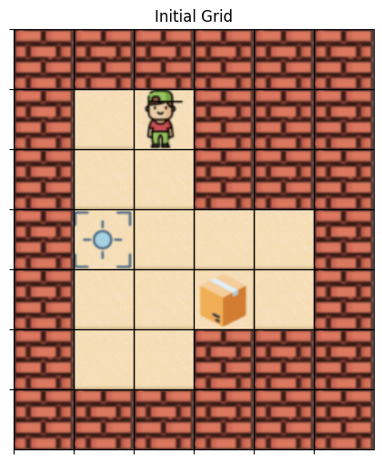

## Assignment 2

### Question 1: Travelling Salesman Problem with 50 targets

In this question it was required to solve the travelling salesman problem for 50 targets.
I have solved it using all three methods that were required. And the results are as follows:

##### Dynamic Programming:

Optimal Policy obtained:
[24 41 34 32 47 13 39 17 47 12 43  4 35 43 26  4 36 41 21 32 25 14  1 41
 41 16 29  6 49 43 44 38 19 45 42 12 47 14 40 36  8 43 37 41 48  5  0  4
 13 11]

##### Monte Carlo First Visit:

Optimal Policy obtained:
[49 38 42  1 19 25 22 39 20 48 42  1 24 48 42 27 15 13  8 11 44 16 38 27
 31 47 15  1  9 48 11 21 18  0 39 21 19  1 37 10 44  7 39 22 33  0 23 46
 10 37]

##### Monte Carlo Every Visit:

Optimal Policy obtained:
Monte Carlo Every Visit Optimal Policy:
[13 14 40 24 28 11 46 22 11 14 47 47 49 23 16 23  7 41  0 32 32 24 30 48
 37  4  3 12 26  1 28 27 49 14 10  5 11 43  6 42 12 12 16 10 17  5  5 41
 32 41]

##### The average value obtained for each method are:

| Method | Average Value|
|----------|----------|
| Dynamic Programming    | -12.065   |
| Monte Carlo First Visit   | -33356.619    |
| Monte Carlo Every Visit    | -33673.252    |

The obtained policies can be visualised by the following diagram:

##### Observation

Dynamic programming performs better than the Monte Carlo Methods as evident from the Average Values for each method. This maybe due to the simple nature of the environment, where choosing the path by using some value as heuristics gives better results rather than choosing optimal path by random sampling which may take far too many steps and slower convergence.

### Question 2: Sokoban Problem

In this problem it was required to set up an environment for the classic Sokoban Puzzle and then solve a given scenario using dynamic programming and Monte Carlo methods.

This was the initial grid:

##### Dynamic Programming:

Obtained Policy:

##### Monte Carlo First Visit:

Obtained Policy:

##### Monte Carlo Every Visit:

Obtained Policy:

##### The average reward obtained and steps taken by each method are:

| Method | Average Reward | Average Steps |
|----------|----------|----------|
| Dynamic Programming    | -0.928   | -    |
| Monte Carlo First Visit   | -200    | 200    |
| Monte Carlo Every Visit    | -100    | 100    |

##### Observation
Dynamic programming seems to have the best results out of the three methods. Although the policies obtained may not appear to be the best, they are better than those obtained from Monte Carlo Methods. Given the complex nature of the problem its surprising that Monte Carlo didn't perform better while it was expected to outperform dynamic programming method. This maybe due to looping between same positions and exhausting all the available moves in an episode and finally not being able to explore the full environment at all.

#### Author
[Manish Gayen](https://github.com/GayenManish07)
