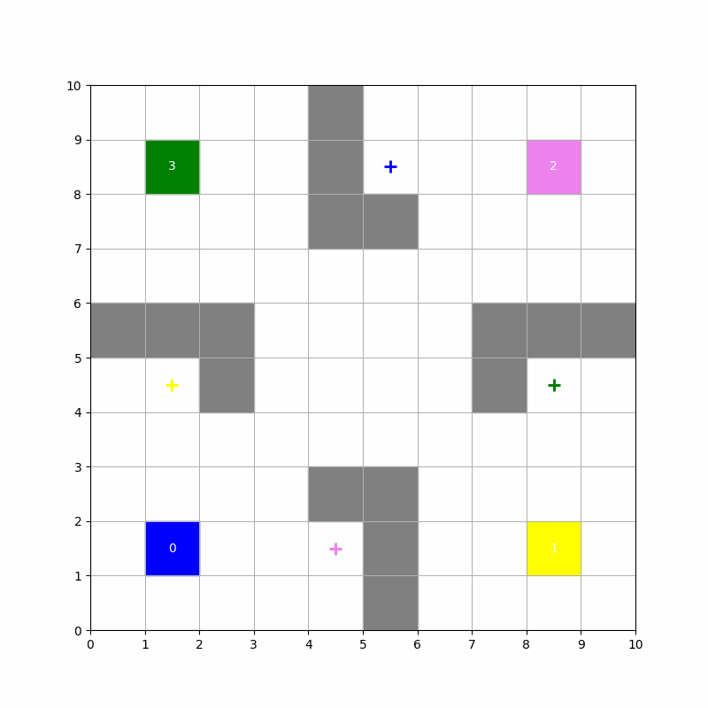
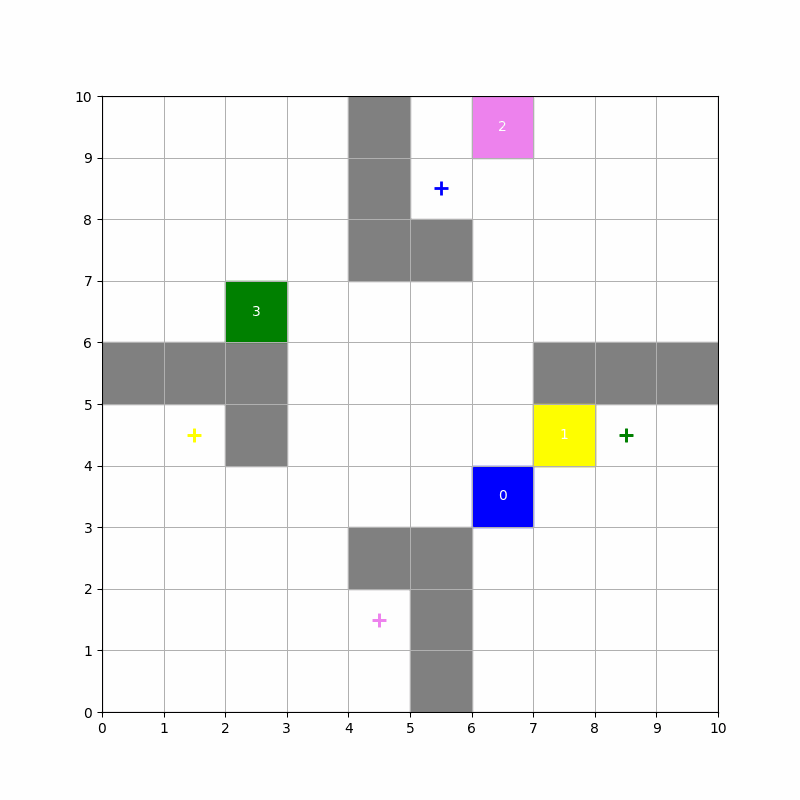

# Assignment-3

NAME: Mohammad Saifullah Khan  
ROLL NO.: 21169  
DEPARTMENT: EECS

## Run the Code:
```bash
python3 -m venv .venv
source .venv/bin/activate
pip3 install matplotlib numpy
python3 answer.py

#To run question-1
Enter mode (random or None): None

#To run question-2
Enter mode (random or None): random
```

## Question-1  

| Hyperparameter | Value |
| -------------- | -------------- |
| Learning Rate (```number of episodes```) | 50000 |
| Discount Factor (```number of steps per episode```) | 10000 |
| Epsilon Start (```epsilon```) | 0.1 |
| Minimum epsilon (```learning rate```) | 0.03 |
| Epsilon Decay Rate (```discount```) | 0.99 |

Minimum steps for each agent to reach their goal: [13. 12. 13. 14.]  
Actual minimum steps for agent green and yellow is 10 and for others is 13.   




## Question-2

| Hyperparameter | Value |
| -------------- | -------------- |
| Learning Rate (```number of episodes```) | 50000 |
| Discount Factor (```number of steps per episode```) | 10000  |
| Epsilon Start (```epsilon```) | 0.1 |
| Minimum epsilon (```learning rate```) | 0.03 |
| Epsilon Decay Rate (```discount```) | 0.99 |  

Minimum steps for each agent to reach their goal: [ 6. 14.  4. 10.]  
Actual minimum steps: 0 for each agent    

  

  


