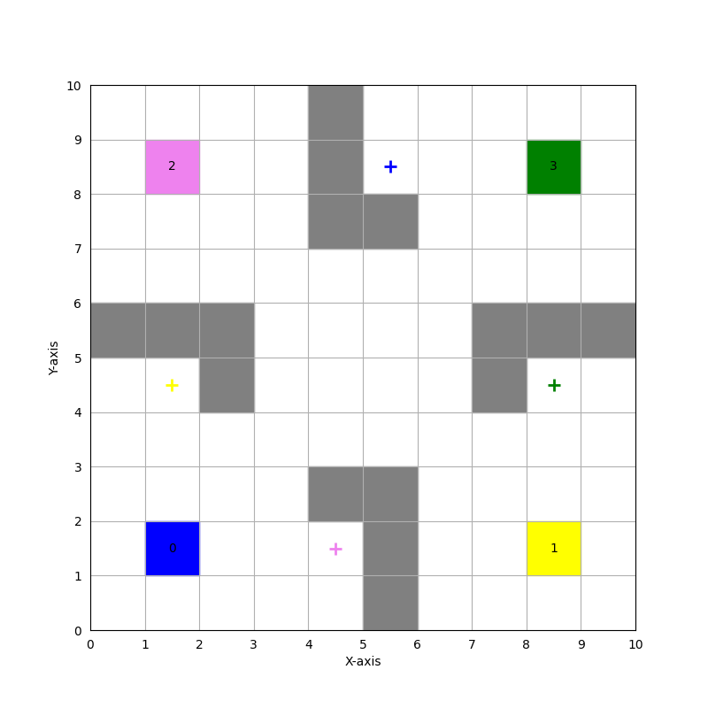
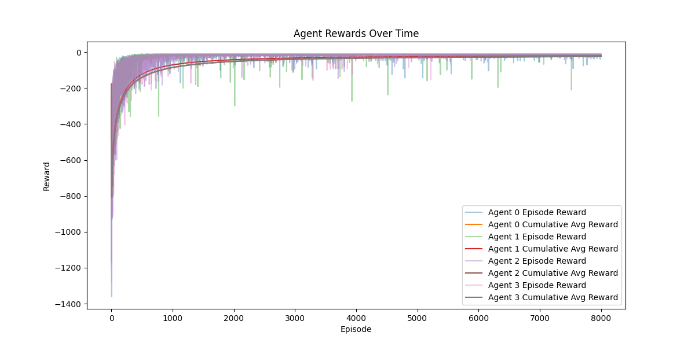
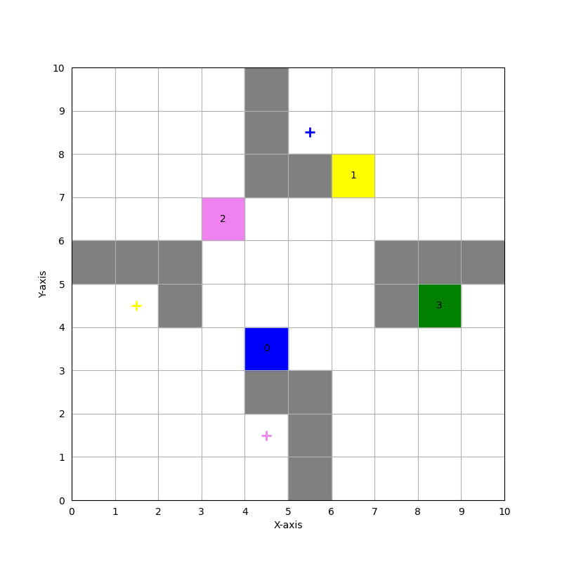

# Assignment-3

NAME: Mohammad Saifullah Khan  
ROLL NO.: 21169  
DEPARTMENT: EECS

## Run the Code:
```bash
python3 -m venv .venv
source .venv/bin/activate
pip3 install matplotlib numpy
python3 answer.py

#To run question-1
Enter mode (random or None): None

#To run question-2
Enter mode (random or None): random
```

## Question-1
Minimum steps for each agent to reach their goal is 10.  

| Hyperparameter | Value |
| -------------- | -------------- |
| Learning Rate (```number of episodes```) | 8000 |
| Discount Factor (```number of steps per episode```) | 3000 |
| Epsilon Start (```epsilon```) | 0.1 |
| Minimum epsilon (```learning rate```) | 0.03 |
| Epsilon Decay Rate (```discount```) | 0.99 |

Minimum steps for each agent to reach their goal: [13. 10. 15. 13.]  
  



## Question-2
Minimum steps for each agent to reach their goal is 0. 

| Hyperparameter | Value |
| -------------- | -------------- |
| Learning Rate (```number of episodes```) | 9000 |
| Discount Factor (```number of steps per episode```) | 4000  |
| Epsilon Start (```epsilon```) | 0.1 |
| Minimum epsilon (```learning rate```) | 0.03 |
| Epsilon Decay Rate (```discount```) | 0.99 |  

Minimum steps for each agent to reach their goal: [14. 12. 9. 2.]  
A random starting position is given below:  
  



