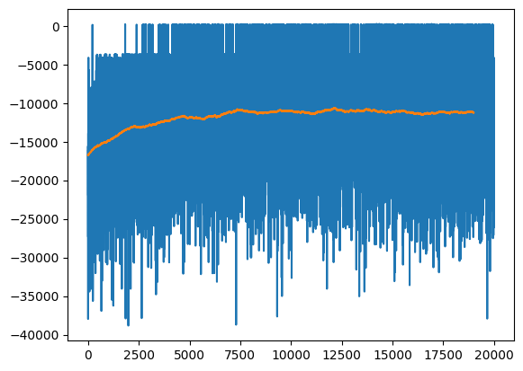
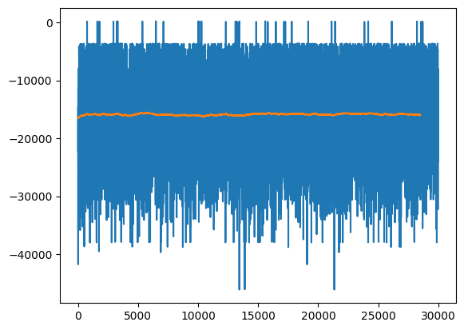
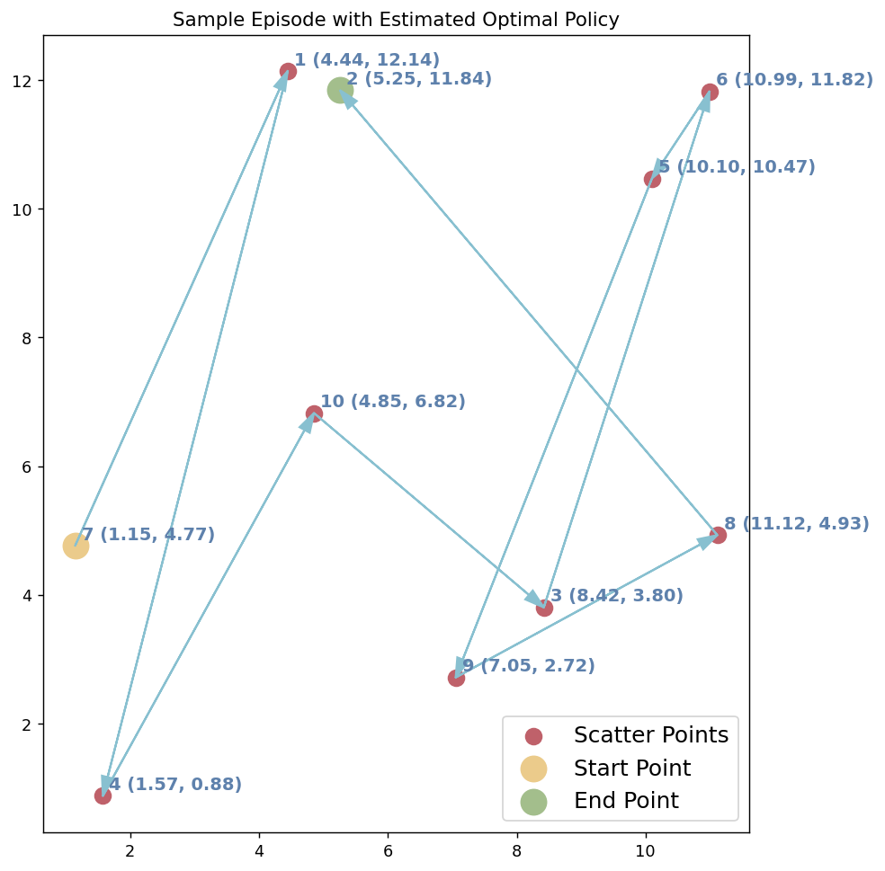
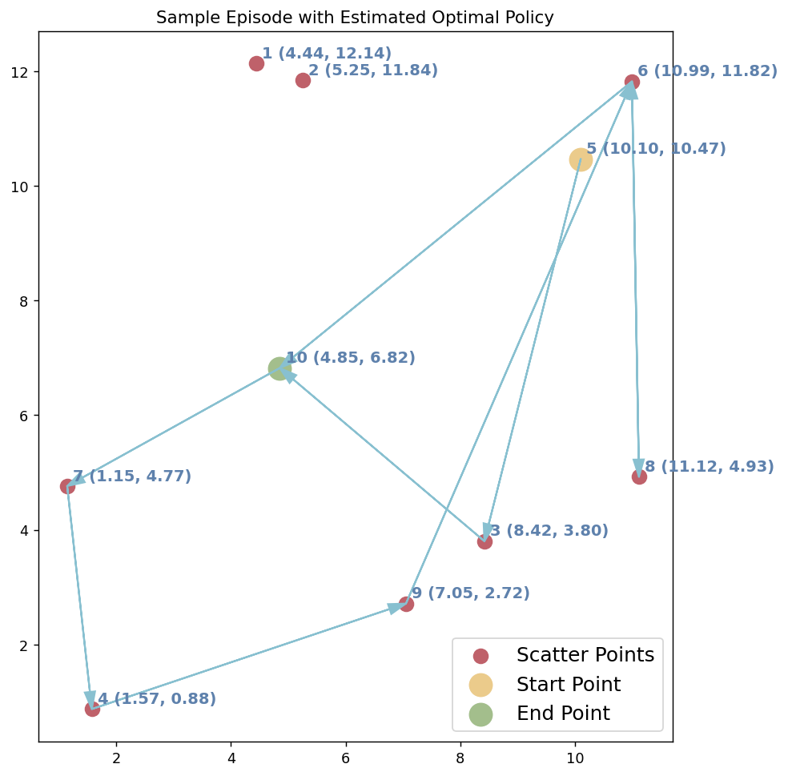

# ECS427 Midsem

## Student Details

**Name:** Sattwik Kumar Sahu

**Roll No.:** `21241`

**Date:** 2024-10-01

---

## Evaluation

- Evaluation of the code can be performed by opening the Jupyter Notebook [ecs427\_\_midsem.ipynb](https://github.com/MOONLABIISERB/marl-ecs-course/blob/6c14fdd99946814044e39658d9fdb852dcb15949/assignments/midsem/ecs427__midsem.ipynb)
- Code and outputs are provided in the notebook.

## Methodology

### Approach

- Two methods were employed to solve the given task.
  - Q-Learning
  - SARSA
- Some extra features were added into these algorithms to get increase performance such as
  - Decaying learning rate $\alpha_{t + 1} = \eta_{\alpha}^{t} \cdot \alpha_t,\; \eta_{\alpha} \in (0, 1]$
  - Decaying epsilon (greediness parameter) $\varepsilon_{t + 1} = \eta_{\varepsilon}^{t} \cdot \varepsilon_t,\; \eta_{\varepsilon} \in (0, 1]$

### Parameters

#### Q-Learning

| Parameter             | Value    |
| --------------------- | -------- |
| $\alpha_{0}$          | `0.13`   |
| $\varepsilon_{0}$     | `0.20`   |
| $\gamma$              | `0.90`   |
| $\eta_{\varepsilon}$  | `0.97`   |
| $\eta_{\alpha}$       | `0.999`  |
| $n_{\text{episodes}}$ | `20 000` |

#### Q-Learning

| Parameter             | Value    |
| --------------------- | -------- |
| $\alpha_{0}$          | `0.03`   |
| $\varepsilon_{0}$     | `0.02`   |
| $\gamma$              | `0.90`   |
| $\eta_{\varepsilon}$  | `0.99`   |
| $\eta_{\alpha}$       | `0.999`  |
| $n_{\text{episodes}}$ | `30 000` |

### Evaluation

- The `main` function provided in the `ModTSP` code was modified to print out a table:
  - For 100 episodes, choose a random starting point and follow the best policy using the Q-Table to get an episode.
  - Calculate the reward for that episode.
  - At the end of 100 episodes, display a table with columns:
    - Serial no. of episode
    - The reward from that episode
    - The states visited in that episode, in sequence
    - The no. of unique states visited in that episode
  - Also, the mean reward per episode is calculated

> Evaluation outputs are provided in the Jupyter Notebook.

## Results

### Training

#### Legend

- **X:** Episode number
- **Y:** Reward
- **Blue line:** Reward per episode
- **Orange line:** Smoothened reward trend

#### Q-Learning

#### SARSA

### Sample Episodes

### Q-Learning

### SARSA

