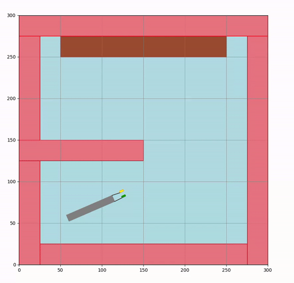
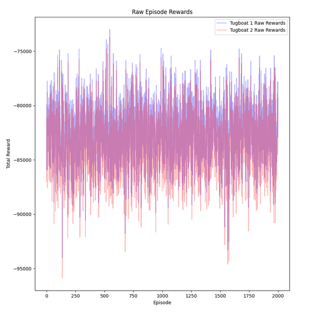
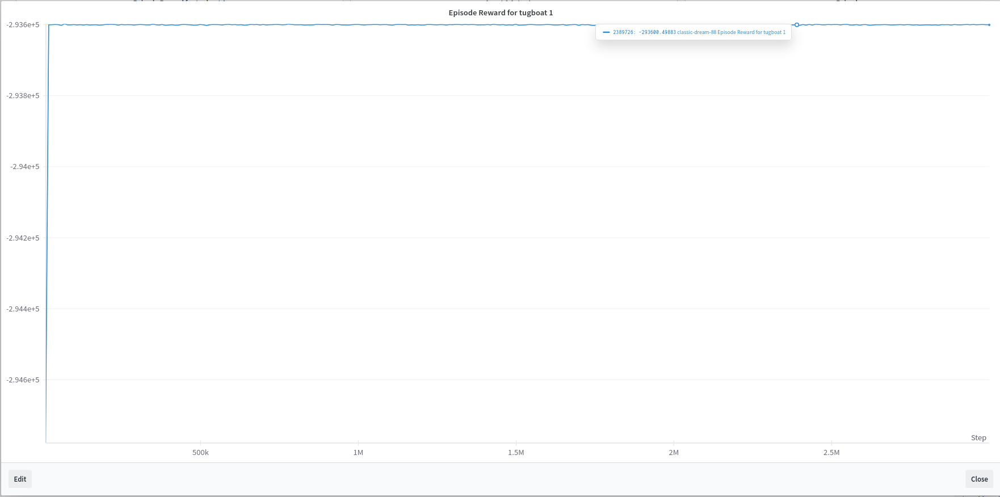
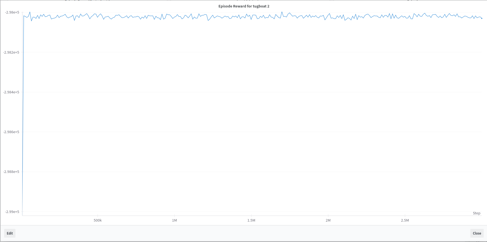
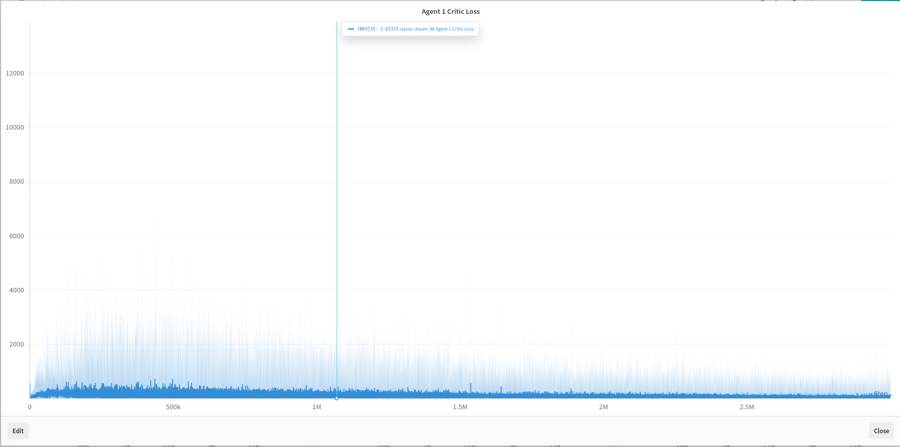
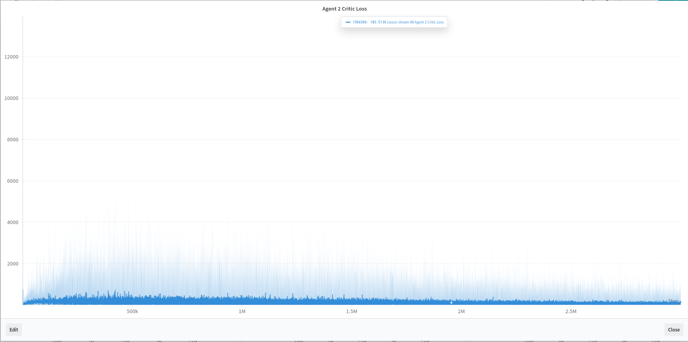
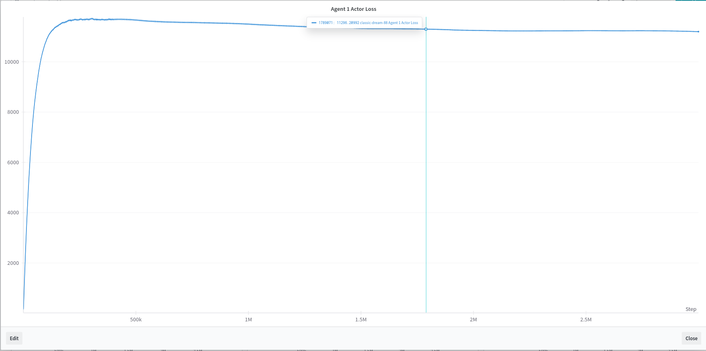
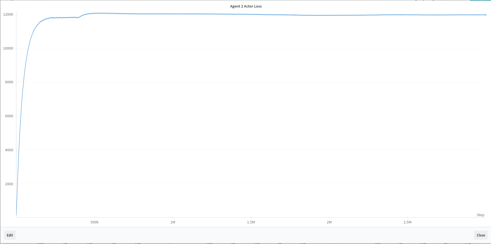
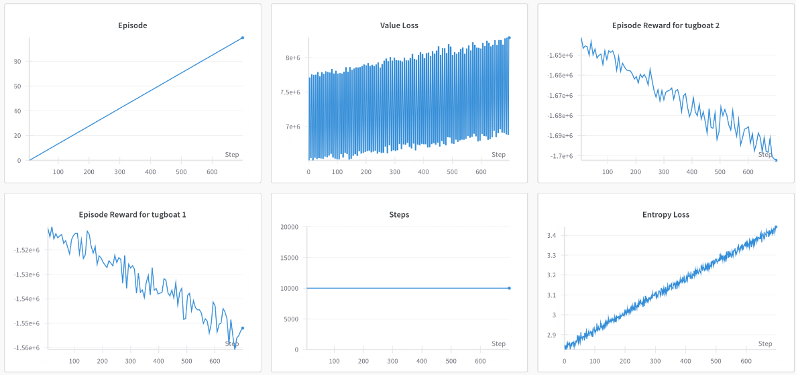

# MARL END SEM PROJECT

NAME: Mohammad Saifullah Khan  
ROLL NO.: 21169  
DEPARTMENT: EECS  

Team:  
Rahul Kulkarni  
Mohammad Saifullah Khan

# NOTE:
MADDPG was implemented by Mohammad Saifullah Khan.  
MAPPO was implemented by Rahul Kulkarni.  

The report is in Report folder

# Run MADDPG
```bash
python3 -m venv .venv
source .venv/bin/activate
pip3 install matplotlib numpy torch rich wandb
cd src
mkdir saved_models
python3 maddpg.py

#To train, run on gpu.
python3 maddpg.py

#To check results for random trajectory of agents
python3 maddpg_env_random.py

# To test, 
# comment the following line in maddpg.py
# device = torch.device("cuda" if torch.cuda.is_available() else "cpu") 
# and uncommment the following line in maddpg.py
# device = "cpu"
# rename the trained model saved on saved_models directory to tugboat_{agent_number}_actor_maddpg.pth
python3 test_maddpg.py
```

# Run MAPPO
```bash 
cd src
python3 mappo.py
```

# Presentation
Check MARL Project.pptx file.

# Environment


# Random Trajectory

Rewards accumulated by each agent following random trajectory


# MADDPG  Results

Rewards accumulated by agent 1 over steps in as follows
    

Rewards accumulated by agent 2 over steps in as follows
    

Critic loss of agent 1  
  

Critic loss of agent 2  
  

Actor loss of agent 1  
  

Actor loss of agent 2   


# MAPPO Results

MAPPO results are as follows
 
