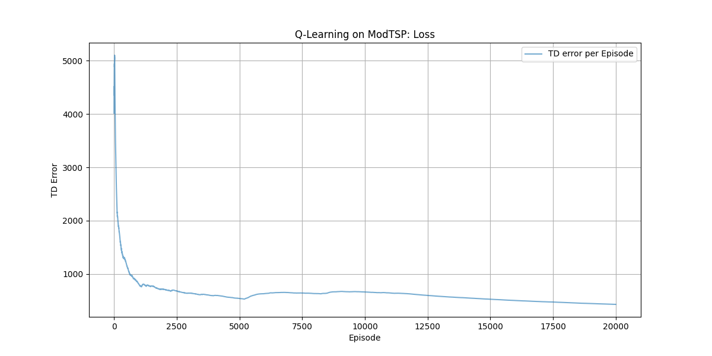
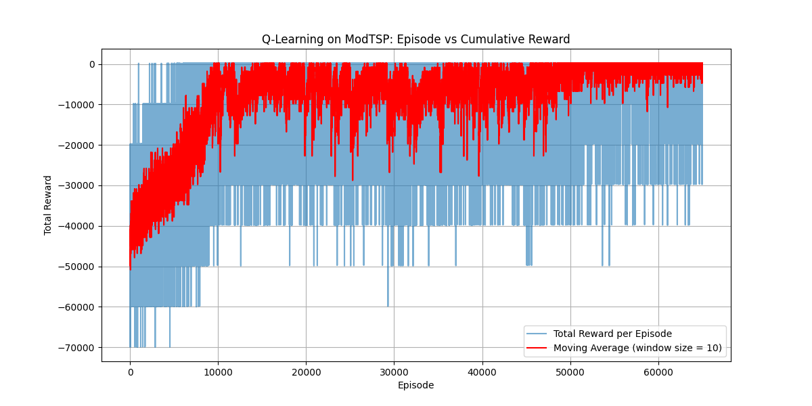
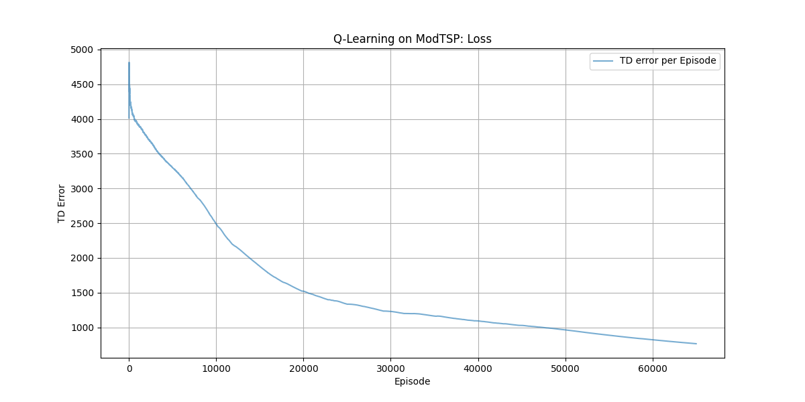
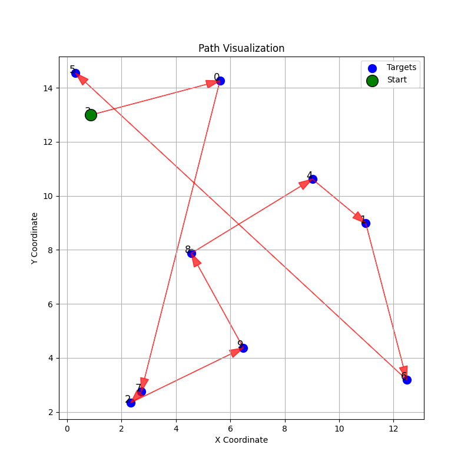

# MID SEM:

NAME: Mohammad Saifullah Khan  
ROLL NO.: 21169  
DEPARTMENT: EECS

## Run the Code:
```bash
python3 -m venv .venv
source .venv/bin/activate
pip3 install gymnasium numpy matplotlib
python3 q_with_epsilon.py
```
Results are saved in home directory in the format ```q_learning_{num_episodes}_{epsilon_start}_{epsilon_end}_{epsilon_decay_steps}.png```. The Q table is also saved in format ```q_table.pkl```.

## ANSWER:

Q-learning with epsilon-greedy is used.  
Epsilon-greedy is implemented as decaying to balance exploration and exploitation.  
At the early stages of training, agent should explore more to gather information about rewards associated with states and actions.   
As agent learns over time it should exploit its learned knowledge.  

High epsilon -> agent takes random actions more frequently.  
Low epsilon -> agent chooses action with maximum q-value.  

In the code,  
```epsilon_start``` -> epsilon at the start of training process.   
```epsilon_end``` -> minimum value of epsilon decay.  
```epsilon_decay_steps``` -> the rate at which the epsilon value decreases.  

Epsion decays by following formula:  
```epsilon_decay = (epsilon_start - epsilon_end) / epsilon_decay_steps```


To run without epsilon-greedy, change the following variables inside ```main()``` function.  
```bash
epsilon_start = 0
epsilon_end = 0
```

To run with with epsilon-greedy, change the following variables inside ```main()``` function.  
```bash
epsilon_start = <some value>
epsilon_end = <some value>
```

## About Code:
```ModeTSP``` class initialize the TSP environment.  

```QLearning``` class initializes agent for q-learning for the tsp environment.  

Hyperparameter:

| Hyperparameter | 
| -------------- | 
| Learning Rate (```alpha```) |
| Discount Factor (```gamma```) | 
| Epsilon Start (```epsilon_start```) |
| Minimum epsilon (```epsilon_end```) |
| Epsilon Decay Rate (```epsilon_decay_steps```) |


Agent Initializations:  
```self.Q_table```: dictionary to store Q-values,  
```self.td_errors```: list to track td errors,  
```self.epsilon_decay```: rate at which epsilon decreases to shift from exploration to exploitation,  


Functions:  

```select_action(self, state: np.ndarray) -> int```  
Selects action based on the current state using an epsilon-greedy policy.  
Exploration: With probability epsilon, selects a random action.  
Exploitation: With probability 1 - epsilon, selects the action with the highest Q-value for the current state.  
Epsilon Update: Decreases epsilon after each action towards epsilon_end.  


```update(self, state: np.ndarray, action: int, reward: float, next_state: np.ndarray) -> None```  
Updates the Q-value table using the Q-learning update rule; ```Q(s, a) = Q(s, a) + alpha [r + gamma max Q(s', a') - Q(s, a)]```  
Q-Value Initialization: Ensures that Q-values for the current and next states are initialized.  
TD Target Calculation: Finds the best next action -> calculate the TD target -> TD error calculation -> Q-value update.  


## Results:

### Run 1
| Hyperparameter | Value |
| -------------- | ----- |
| Learning Rate (```alpha```) | 0.03 |
| Discount Factor (```gamma```) | 0.99 |
| Epsilon Start (```epsilon_start```) | 0.5 |
| Minimum epsilon (```epsilon_end```) | 0.01 |
| Epsilon Decay Rate (```epsilon_decay_steps```) | 300 |
| Number of Episodes (```num_episodes```) | 20000 |   
Average Return = -4250.63,    
Average TD error = 634.24,    
Convergence of returns at 176.36  

  


### Run 2
| Hyperparameter | Value |
| -------------- | ----- |
| Learning Rate (```alpha```) | 0.03 |
| Discount Factor (```gamma```) | 0.99 |
| Epsilon Start (```epsilon_start```) | 0.5 |
| Minimum epsilon (```epsilon_end```) | 0.01 |
| Epsilon Decay Rate (```epsilon_decay_steps```) | 100000 |
| Number of Episodes (```num_episodes```) | 65000 |    
Average Return = -7628.34,    
Average TD error = 1546.64,    
Convergence of returns at 252.90   





## Discussion
In run 1, the decay of epsilon is fast. It is exploring for less time eventually setting to epsilon = 0.01. The convergence seems to be faster.  

In run 2, the decay of epsilon is reltively slow. It is getting more time to explore eventually setting to epsilon = 0.01.   The convergence is slower. It was also observed that on setting number of episodes to 100000, the total reward of episodes started to fluctuate more after crossing ~75000 episodes (Plot not shown here).    


## Improvements
The results can further be improved by exploring different functions for epsilon decay, hyperparameter tuning, changing the state space of the environment. Also, other techniques like DQN, SAC, etc. can also be implemented to assess the results.
  
   


