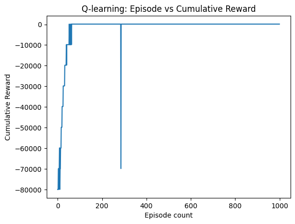

## MIDSEM PROBLEM

##### MANISH GAYEN, Roll: 21161

Travelling Salesman Problem with reshuffling of profits after k episodes as well as profit funciton dependent on past profit.

Due the shuffling of profits the environment can be deemed to be somewhat dynamic.

I have used Q-Learning algorithm to solve this problem.

Since the environment was predefined, I have just implemented a standard Q-Learning algorithm and experimented on various hyperparamters. The hyperparameters in context are:

alpha(𝛼): The learning rate, it controls how much new information overrides old information. A high 𝛼 updates Q-values more rapidly, while a low  α makes learning slower and more stable.

gamma(γ): The discount factor, it determines the importance of future rewards. A high 𝛾 focuses more on long-term rewards, while a low 𝛾 prioritizes immediate rewards.

epsilon(ϵ): The exploration rate, it controls the balance between exploration (trying new actions) and exploitation (using known, high-reward actions). A high ϵ encourages exploration, while a low ϵ focuses more on exploitation.

After experimenting with various hyperparameter combination I settled on the following combination as it provided the best results:
alpha=0.009, gamma=0.05, epsilon=0.0001

Due to the dynamic nature of the problem, I had expected higher alpha value would be more appropriate, but turns out that lower values seem to give better results.
Gamma has very little impact on the results and makes negligible difference in maximum hyperparameter combinations.

Low epsilon value shows that rather than exploring, prior knowledge proves to be more essential in this environment.

The episode vs cumulative reward plot is as follows:

Some other statistics:

Positive rewards count:  940

Highest cumulative reward achieved: 142.55840587615967

Average cumulative rewards value: -2006.423940320015

If we increase episode count, we can achieve better average cumulative reward.