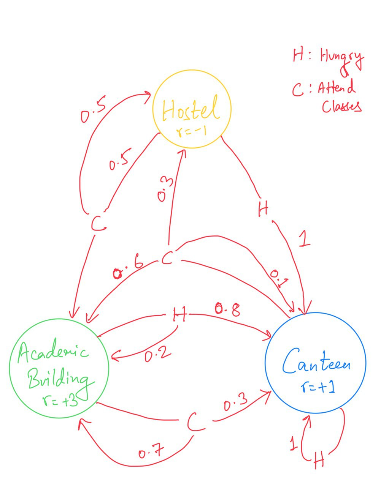
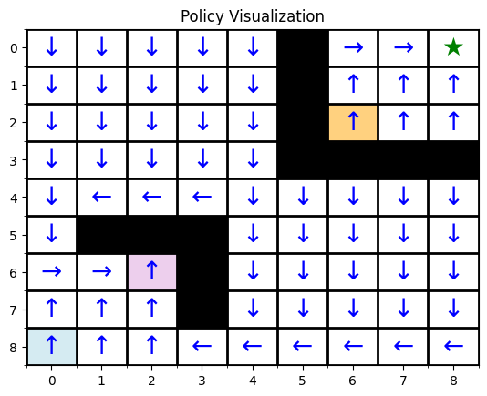
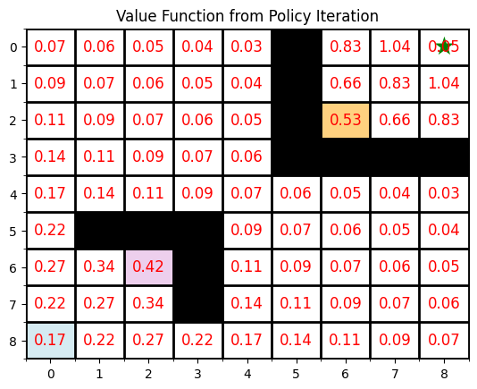

# MARL Assignment 1

This is a solution for the MARL course Assignment 1

## Contents

1. [Question 1](#question-1)
2. [Question 2](#question-2)
3. [Requirements](#requirements)
4. [Author](#requirements)

## Question 1

Question 1 involves modelling the college life of a student into a MDP and finding out optimal policies for his actions using value iteration and policy iteration methods.

The MDP designed can be represented by the following diagram:

The results obtained are:

Value Iteration Results: 

Values:  [12.98306307 12.98306307 12.98306307 13.39809229 13.3145874  
13.3145874 ] 
Policy:  ['Eat_Food', 'Eat_Food', 'Eat_Food', 'Attend_Class', 'Attend_Class', 
'Attend_Class']

Policy Iteration Results: 

Values:  [12.98304403 12.98304403 12.98304403 13.39807276 13.31457007 
13.31457007] 

Policy:  ['Eat_Food', 'Eat_Food', 'Eat_Food', 'Attend_Class', 'Attend_Class', 
'Attend_Class']

The results from both Value Iteration and Policy Iteration are consistent. Both methods produce nearly identical value functions and the same optimal policy. The optimal actions are: Eat_Food in the Hostel and when Hungry. Attend_Class in the Academic Building and Canteen. This consistency indicates that both algorithms have successfully identified the optimal policy for the student’s task, validating the MDP solution.

## Question 2

Question 2 involves solving a grid problem where a robot needs to reach a certain goal position. There are obstructions present in the grid to make the scenario more challenging. Further there the goal position is entirely cutoff from rest of the grid using obstructions, and can only be reached through another grid position that has a teleportation mechanism that directly transports the robot inside the cutoff section with the goal.
Value iteration and Policy iteration methods were used to find the optimal policies and the results obtained are:

Value iteration:

Policy iteration:

## Requirements:

The code has been run on python 3.10.6
And the additional libraries used are numpy and matplotlib.

## Author: 

The project has been done by [Manish Gayen](https://github.com/GayenManish07)

Roll Number: 21161

IISERB
